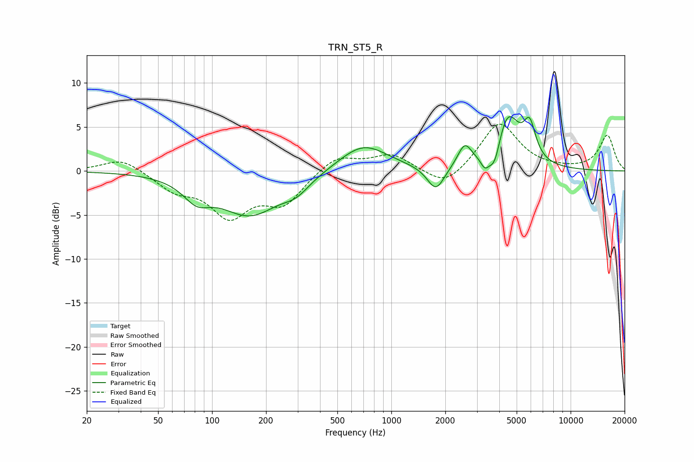

# TRN_ST5_R
See [usage instructions](https://github.com/jaakkopasanen/AutoEq#usage) for more options and info.

### Parametric EQs
Apply preamp of -6.3 dB when using parametric equalizer.

|   # | Type    |   Fc (Hz) |    Q |   Gain (dB) |
|-----|---------|-----------|------|-------------|
|   1 | Peaking |        82 | 1.9  |        -2.1 |
|   2 | Peaking |       163 | 0.83 |        -4.8 |
|   3 | Peaking |       295 | 1.91 |        -1.3 |
|   4 | Peaking |       696 | 1.03 |         3.1 |
|   5 | Peaking |      1772 | 2.94 |        -2.8 |
|   6 | Peaking |      2565 | 3.62 |         2.5 |
|   7 | Peaking |      3321 | 6    |        -1.4 |
|   8 | Peaking |      3771 | 4.22 |        -3   |
|   9 | Peaking |      4436 | 2.08 |         6.4 |
|  10 | Peaking |      5907 | 4.16 |         3.8 |

### Fixed Band EQs
When using fixed band (also called graphic) equalizer, apply preamp of **-5.4 dB** (if available) and set gains manually with these parameters.

|   # | Type    |   Fc (Hz) |    Q |   Gain (dB) |
|-----|---------|-----------|------|-------------|
|   1 | Peaking |        31 | 1.41 |         1.5 |
|   2 | Peaking |        62 | 1.41 |        -1.9 |
|   3 | Peaking |       125 | 1.41 |        -4.8 |
|   4 | Peaking |       250 | 1.41 |        -3.5 |
|   5 | Peaking |       500 | 1.41 |         1.8 |
|   6 | Peaking |      1000 | 1.41 |         1.8 |
|   7 | Peaking |      2000 | 1.41 |        -2.1 |
|   8 | Peaking |      4000 | 1.41 |         5.6 |
|   9 | Peaking |      8000 | 1.41 |         0.1 |
|  10 | Peaking |     16000 | 1.41 |         4   |

### Graphs

