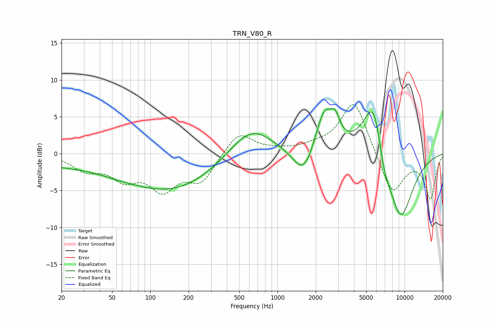

# TRN_V80_R
See [usage instructions](https://github.com/jaakkopasanen/AutoEq#usage) for more options and info.

### Parametric EQs
Apply preamp of -6.2 dB when using parametric equalizer.

|   # | Type    |   Fc (Hz) |    Q |   Gain (dB) |
|-----|---------|-----------|------|-------------|
|   1 | Peaking |        20 | 0.21 |        -1.4 |
|   2 | Peaking |        56 | 1.62 |        -0.1 |
|   3 | Peaking |       155 | 0.4  |        -4.6 |
|   4 | Peaking |       614 | 0.82 |         4.3 |
|   5 | Peaking |      1621 | 1.65 |        -4.3 |
|   6 | Peaking |      2344 | 1.89 |         6.2 |
|   7 | Peaking |      2859 | 4.37 |         2   |
|   8 | Peaking |      5776 | 1.62 |         9.9 |
|   9 | Peaking |      6847 | 2.5  |        -3.6 |
|  10 | Peaking |      9260 | 1.21 |        -9.7 |

### Fixed Band EQs
When using fixed band (also called graphic) equalizer, apply preamp of **-6.7 dB** (if available) and set gains manually with these parameters.

|   # | Type    |   Fc (Hz) |    Q |   Gain (dB) |
|-----|---------|-----------|------|-------------|
|   1 | Peaking |        31 | 1.41 |        -2   |
|   2 | Peaking |        62 | 1.41 |        -2.9 |
|   3 | Peaking |       125 | 1.41 |        -4.4 |
|   4 | Peaking |       250 | 1.41 |        -3.6 |
|   5 | Peaking |       500 | 1.41 |         3.1 |
|   6 | Peaking |      1000 | 1.41 |         0.3 |
|   7 | Peaking |      2000 | 1.41 |         0.7 |
|   8 | Peaking |      4000 | 1.41 |         7.4 |
|   9 | Peaking |      8000 | 1.41 |        -5.7 |
|  10 | Peaking |     16000 | 1.41 |        -6   |

### Graphs

