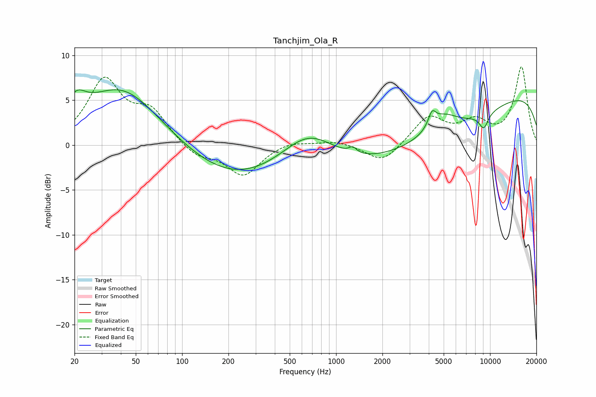

# Tanchjim_Ola_R
See [usage instructions](https://github.com/jaakkopasanen/AutoEq#usage) for more options and info.

### Parametric EQs
Apply preamp of -6.3 dB when using parametric equalizer.

|   # | Type    |   Fc (Hz) |    Q |   Gain (dB) |
|-----|---------|-----------|------|-------------|
|   1 | Peaking |        20 | 2.32 |         2.4 |
|   2 | Peaking |        41 | 0.57 |         6.5 |
|   3 | Peaking |       222 | 0.42 |        -3.8 |
|   4 | Peaking |       663 | 0.83 |         3.6 |
|   5 | Peaking |      1283 | 5.95 |         0.7 |
|   6 | Peaking |      3432 | 0.25 |        -5   |
|   7 | Peaking |      4202 | 5.67 |         1.6 |
|   8 | Peaking |      4957 | 1.55 |         2   |
|   9 | Peaking |      9105 | 4.21 |        -1.7 |
|  10 | Peaking |      9912 | 0.18 |         6.8 |

### Fixed Band EQs
When using fixed band (also called graphic) equalizer, apply preamp of **-8.8 dB** (if available) and set gains manually with these parameters.

|   # | Type    |   Fc (Hz) |    Q |   Gain (dB) |
|-----|---------|-----------|------|-------------|
|   1 | Peaking |        31 | 1.41 |         7   |
|   2 | Peaking |        62 | 1.41 |         3.4 |
|   3 | Peaking |       125 | 1.41 |        -1.4 |
|   4 | Peaking |       250 | 1.41 |        -3.4 |
|   5 | Peaking |       500 | 1.41 |         0.6 |
|   6 | Peaking |      1000 | 1.41 |         0.5 |
|   7 | Peaking |      2000 | 1.41 |        -2.1 |
|   8 | Peaking |      4000 | 1.41 |         3.1 |
|   9 | Peaking |      8000 | 1.41 |         2.3 |
|  10 | Peaking |     16000 | 1.41 |         8.6 |

### Graphs

