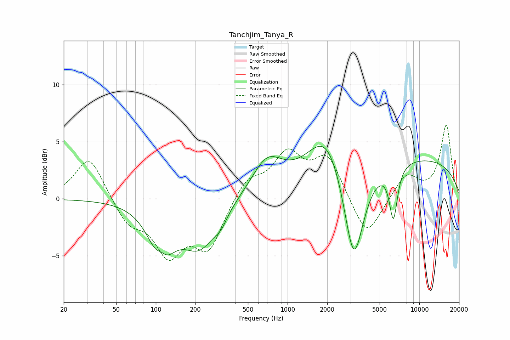

# Tanchjim_Tanya_R
See [usage instructions](https://github.com/jaakkopasanen/AutoEq#usage) for more options and info.

### Parametric EQs
Apply preamp of -4.7 dB when using parametric equalizer.

|   # | Type    |   Fc (Hz) |    Q |   Gain (dB) |
|-----|---------|-----------|------|-------------|
|   1 | Peaking |       110 | 3.28 |         1.4 |
|   2 | Peaking |       110 | 1.7  |        -5.4 |
|   3 | Peaking |       112 | 2.49 |         0.5 |
|   4 | Peaking |       215 | 1.04 |        -4   |
|   5 | Peaking |       312 | 3.16 |        -0.8 |
|   6 | Peaking |       698 | 1.21 |         3   |
|   7 | Peaking |      1976 | 1.05 |         4   |
|   8 | Peaking |      3179 | 1.79 |        -9.4 |
|   9 | Peaking |      6358 | 4.46 |        -4.6 |
|  10 | Peaking |      7439 | 0.18 |         3.7 |

### Fixed Band EQs
When using fixed band (also called graphic) equalizer, apply preamp of **-6.5 dB** (if available) and set gains manually with these parameters.

|   # | Type    |   Fc (Hz) |    Q |   Gain (dB) |
|-----|---------|-----------|------|-------------|
|   1 | Peaking |        31 | 1.41 |         3.8 |
|   2 | Peaking |        62 | 1.41 |        -2.1 |
|   3 | Peaking |       125 | 1.41 |        -4.5 |
|   4 | Peaking |       250 | 1.41 |        -4.2 |
|   5 | Peaking |       500 | 1.41 |         1.8 |
|   6 | Peaking |      1000 | 1.41 |         3.7 |
|   7 | Peaking |      2000 | 1.41 |         3.6 |
|   8 | Peaking |      4000 | 1.41 |        -3.6 |
|   9 | Peaking |      8000 | 1.41 |         2.1 |
|  10 | Peaking |     16000 | 1.41 |         6.4 |

### Graphs

