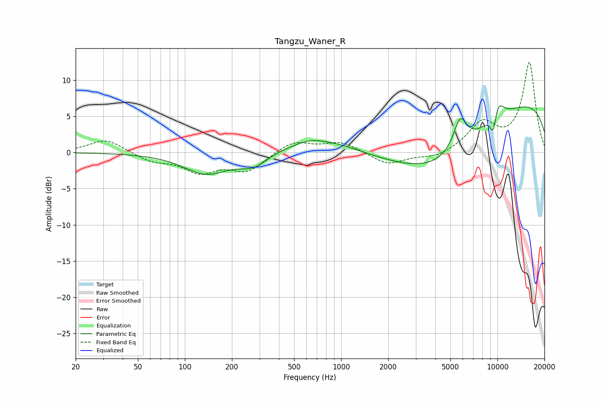

# Tangzu_Waner_R
See [usage instructions](https://github.com/jaakkopasanen/AutoEq#usage) for more options and info.

### Parametric EQs
Apply preamp of -6.5 dB when using parametric equalizer.

|   # | Type    |   Fc (Hz) |    Q |   Gain (dB) |
|-----|---------|-----------|------|-------------|
|   1 | Peaking |       137 | 0.97 |        -2.9 |
|   2 | Peaking |       275 | 1.56 |        -1.8 |
|   3 | Peaking |       628 | 1.76 |         0.4 |
|   4 | Peaking |       822 | 0.56 |         2.6 |
|   5 | Peaking |      3874 | 0.25 |        -4.1 |
|   6 | Peaking |      4131 | 0.53 |        -4.7 |
|   7 | Peaking |      5776 | 3.15 |         4.3 |
|   8 | Peaking |      9422 | 5.5  |        -4   |
|   9 | Peaking |      9846 | 0.18 |         8.7 |
|  10 | Peaking |      9852 | 2.95 |         3.7 |

### Fixed Band EQs
When using fixed band (also called graphic) equalizer, apply preamp of **-12.5 dB** (if available) and set gains manually with these parameters.

|   # | Type    |   Fc (Hz) |    Q |   Gain (dB) |
|-----|---------|-----------|------|-------------|
|   1 | Peaking |        31 | 1.41 |         1.9 |
|   2 | Peaking |        62 | 1.41 |        -1.1 |
|   3 | Peaking |       125 | 1.41 |        -2.5 |
|   4 | Peaking |       250 | 1.41 |        -2.5 |
|   5 | Peaking |       500 | 1.41 |         1.6 |
|   6 | Peaking |      1000 | 1.41 |         1.4 |
|   7 | Peaking |      2000 | 1.41 |        -1.7 |
|   8 | Peaking |      4000 | 1.41 |        -0.8 |
|   9 | Peaking |      8000 | 1.41 |         3.9 |
|  10 | Peaking |     16000 | 1.41 |        12.4 |

### Graphs

