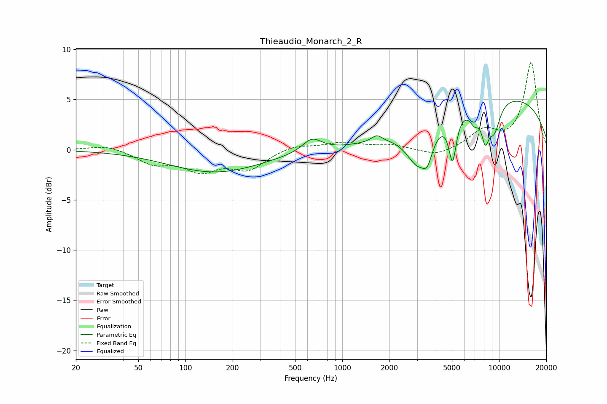

# Thieaudio_Monarch_2_R
See [usage instructions](https://github.com/jaakkopasanen/AutoEq#usage) for more options and info.

### Parametric EQs
Apply preamp of -4.9 dB when using parametric equalizer.

|   # | Type    |   Fc (Hz) |    Q |   Gain (dB) |
|-----|---------|-----------|------|-------------|
|   1 | Peaking |       155 | 0.48 |        -2.2 |
|   2 | Peaking |       641 | 2.33 |         1.3 |
|   3 | Peaking |      1662 | 4.15 |         0.7 |
|   4 | Peaking |      3037 | 1.86 |        -3.8 |
|   5 | Peaking |      3497 | 4.47 |        -1.8 |
|   6 | Peaking |      5050 | 5.83 |        -4.4 |
|   7 | Peaking |      6968 | 4.47 |        -1.3 |
|   8 | Peaking |      8159 | 5.33 |        -3   |
|   9 | Peaking |      9314 | 3.26 |        -2.9 |
|  10 | Peaking |     10000 | 0.24 |         5.4 |

### Fixed Band EQs
When using fixed band (also called graphic) equalizer, apply preamp of **-8.8 dB** (if available) and set gains manually with these parameters.

|   # | Type    |   Fc (Hz) |    Q |   Gain (dB) |
|-----|---------|-----------|------|-------------|
|   1 | Peaking |        31 | 1.41 |         0.5 |
|   2 | Peaking |        62 | 1.41 |        -1.3 |
|   3 | Peaking |       125 | 1.41 |        -1.9 |
|   4 | Peaking |       250 | 1.41 |        -1.8 |
|   5 | Peaking |       500 | 1.41 |         0.5 |
|   6 | Peaking |      1000 | 1.41 |         0.7 |
|   7 | Peaking |      2000 | 1.41 |         0.5 |
|   8 | Peaking |      4000 | 1.41 |        -0.7 |
|   9 | Peaking |      8000 | 1.41 |         1.8 |
|  10 | Peaking |     16000 | 1.41 |         8.7 |

### Graphs

