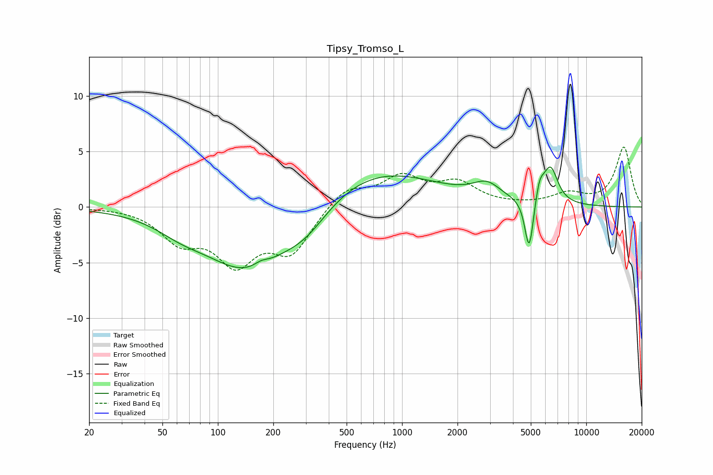

# Tipsy_Tromso_L
See [usage instructions](https://github.com/jaakkopasanen/AutoEq#usage) for more options and info.

### Parametric EQs
Apply preamp of -3.7 dB when using parametric equalizer.

|   # | Type    |   Fc (Hz) |    Q |   Gain (dB) |
|-----|---------|-----------|------|-------------|
|   1 | Peaking |        63 | 1.12 |        -0.9 |
|   2 | Peaking |       145 | 0.61 |        -5.7 |
|   3 | Peaking |       172 | 3.64 |         0.4 |
|   4 | Peaking |       301 | 1.11 |        -1.9 |
|   5 | Peaking |       704 | 0.42 |         3.5 |
|   6 | Peaking |      2883 | 1.86 |         1.4 |
|   7 | Peaking |      4897 | 6    |        -4.1 |
|   8 | Peaking |      4915 | 6    |        -0.8 |
|   9 | Peaking |      5584 | 5.96 |         1.6 |
|  10 | Peaking |      6395 | 3.44 |         3.3 |

### Fixed Band EQs
When using fixed band (also called graphic) equalizer, apply preamp of **-5.5 dB** (if available) and set gains manually with these parameters.

|   # | Type    |   Fc (Hz) |    Q |   Gain (dB) |
|-----|---------|-----------|------|-------------|
|   1 | Peaking |        31 | 1.41 |         0   |
|   2 | Peaking |        62 | 1.41 |        -2.8 |
|   3 | Peaking |       125 | 1.41 |        -4.6 |
|   4 | Peaking |       250 | 1.41 |        -3.8 |
|   5 | Peaking |       500 | 1.41 |         1.8 |
|   6 | Peaking |      1000 | 1.41 |         2.5 |
|   7 | Peaking |      2000 | 1.41 |         2   |
|   8 | Peaking |      4000 | 1.41 |         0.1 |
|   9 | Peaking |      8000 | 1.41 |         1.1 |
|  10 | Peaking |     16000 | 1.41 |         5.4 |

### Graphs

