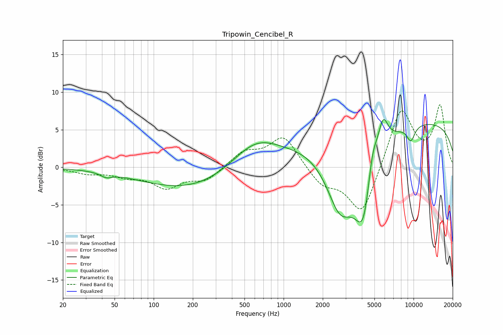

# Tripowin_Cencibel_R
See [usage instructions](https://github.com/jaakkopasanen/AutoEq#usage) for more options and info.

### Parametric EQs
Apply preamp of -6.4 dB when using parametric equalizer.

|   # | Type    |   Fc (Hz) |    Q |   Gain (dB) |
|-----|---------|-----------|------|-------------|
|   1 | Peaking |        43 | 3.34 |        -0.6 |
|   2 | Peaking |       216 | 0.35 |        -3.2 |
|   3 | Peaking |       601 | 0.71 |         4.5 |
|   4 | Peaking |      1570 | 0.63 |         1.2 |
|   5 | Peaking |      2723 | 1.25 |        -8.5 |
|   6 | Peaking |      4136 | 1.84 |       -10.6 |
|   7 | Peaking |      4810 | 3.67 |         4.3 |
|   8 | Peaking |      5815 | 3.47 |         4.3 |
|   9 | Peaking |      9521 | 4.04 |        -2   |
|  10 | Peaking |     10000 | 0.18 |         6.2 |

### Fixed Band EQs
When using fixed band (also called graphic) equalizer, apply preamp of **-8.4 dB** (if available) and set gains manually with these parameters.

|   # | Type    |   Fc (Hz) |    Q |   Gain (dB) |
|-----|---------|-----------|------|-------------|
|   1 | Peaking |        31 | 1.41 |        -0.7 |
|   2 | Peaking |        62 | 1.41 |        -1   |
|   3 | Peaking |       125 | 1.41 |        -2.5 |
|   4 | Peaking |       250 | 1.41 |        -1.7 |
|   5 | Peaking |       500 | 1.41 |         2   |
|   6 | Peaking |      1000 | 1.41 |         4.2 |
|   7 | Peaking |      2000 | 1.41 |        -2.3 |
|   8 | Peaking |      4000 | 1.41 |        -6.5 |
|   9 | Peaking |      8000 | 1.41 |         8   |
|  10 | Peaking |     16000 | 1.41 |         8   |

### Graphs

