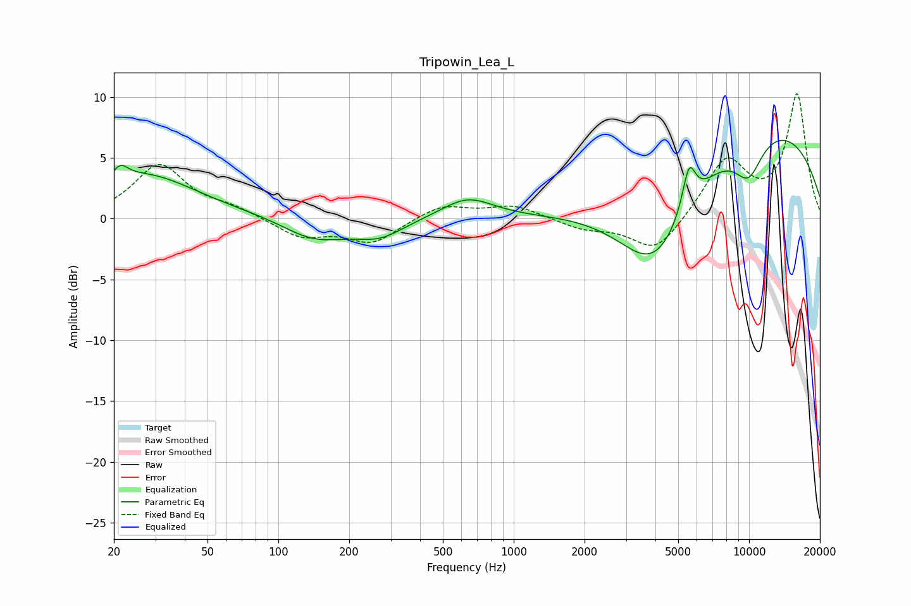

# Tripowin_Lea_L
See [usage instructions](https://github.com/jaakkopasanen/AutoEq#usage) for more options and info.

### Parametric EQs
Apply preamp of -6.5 dB when using parametric equalizer.

|   # | Type    |   Fc (Hz) |    Q |   Gain (dB) |
|-----|---------|-----------|------|-------------|
|   1 | Peaking |        21 | 4.75 |         1   |
|   2 | Peaking |        26 | 0.61 |         3.6 |
|   3 | Peaking |       102 | 0.87 |         0.3 |
|   4 | Peaking |       141 | 0.96 |        -2   |
|   5 | Peaking |       270 | 1.37 |        -1.3 |
|   6 | Peaking |       637 | 1.28 |         1.7 |
|   7 | Peaking |      3998 | 0.82 |        -8.4 |
|   8 | Peaking |      5557 | 4.85 |         3.6 |
|   9 | Peaking |      9942 | 1.97 |        -3.2 |
|  10 | Peaking |     10000 | 0.25 |         8.2 |

### Fixed Band EQs
When using fixed band (also called graphic) equalizer, apply preamp of **-10.3 dB** (if available) and set gains manually with these parameters.

|   # | Type    |   Fc (Hz) |    Q |   Gain (dB) |
|-----|---------|-----------|------|-------------|
|   1 | Peaking |        31 | 1.41 |         4.4 |
|   2 | Peaking |        62 | 1.41 |         0.7 |
|   3 | Peaking |       125 | 1.41 |        -1.5 |
|   4 | Peaking |       250 | 1.41 |        -2   |
|   5 | Peaking |       500 | 1.41 |         1.2 |
|   6 | Peaking |      1000 | 1.41 |         1.1 |
|   7 | Peaking |      2000 | 1.41 |        -0.8 |
|   8 | Peaking |      4000 | 1.41 |        -2.9 |
|   9 | Peaking |      8000 | 1.41 |         4.8 |
|  10 | Peaking |     16000 | 1.41 |        10.1 |

### Graphs

