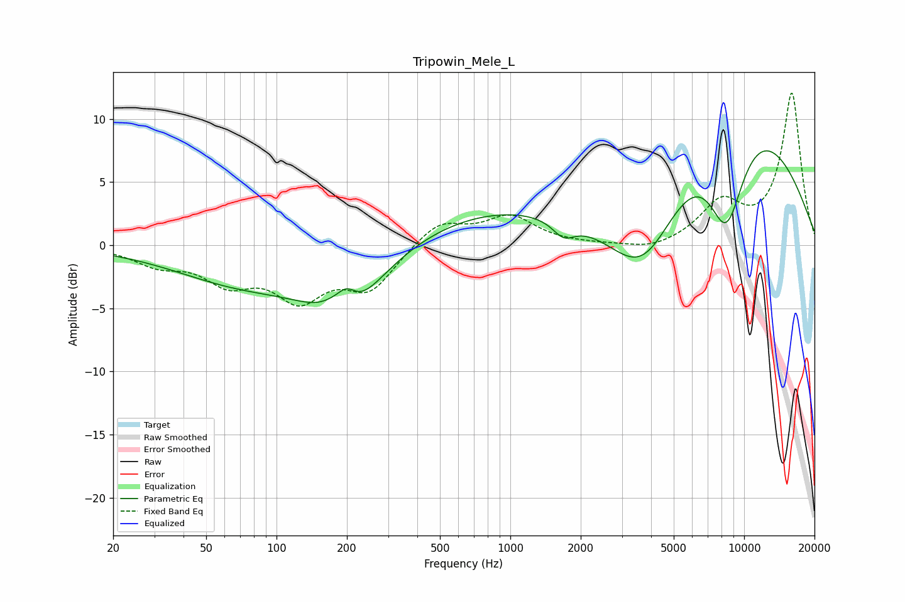

# Tripowin_Mele_L
See [usage instructions](https://github.com/jaakkopasanen/AutoEq#usage) for more options and info.

### Parametric EQs
Apply preamp of -7.6 dB when using parametric equalizer.

|   # | Type    |   Fc (Hz) |    Q |   Gain (dB) |
|-----|---------|-----------|------|-------------|
|   1 | Peaking |        68 | 0.49 |        -2.4 |
|   2 | Peaking |       178 | 2    |         1.6 |
|   3 | Peaking |       193 | 1.04 |        -5.3 |
|   4 | Peaking |       200 | 3.4  |         1.5 |
|   5 | Peaking |       497 | 0.18 |        -1.8 |
|   6 | Peaking |      1690 | 2.96 |        -1.3 |
|   7 | Peaking |      1839 | 0.18 |         5.8 |
|   8 | Peaking |      3704 | 0.64 |       -12.6 |
|   9 | Peaking |      8124 | 0.35 |        12.7 |
|  10 | Peaking |      8390 | 1.48 |        -9.2 |

### Fixed Band EQs
When using fixed band (also called graphic) equalizer, apply preamp of **-12.1 dB** (if available) and set gains manually with these parameters.

|   # | Type    |   Fc (Hz) |    Q |   Gain (dB) |
|-----|---------|-----------|------|-------------|
|   1 | Peaking |        31 | 1.41 |        -1.3 |
|   2 | Peaking |        62 | 1.41 |        -2.5 |
|   3 | Peaking |       125 | 1.41 |        -3.8 |
|   4 | Peaking |       250 | 1.41 |        -3.3 |
|   5 | Peaking |       500 | 1.41 |         1.9 |
|   6 | Peaking |      1000 | 1.41 |         2.2 |
|   7 | Peaking |      2000 | 1.41 |        -0   |
|   8 | Peaking |      4000 | 1.41 |        -0.5 |
|   9 | Peaking |      8000 | 1.41 |         3.1 |
|  10 | Peaking |     16000 | 1.41 |        12   |

### Graphs

