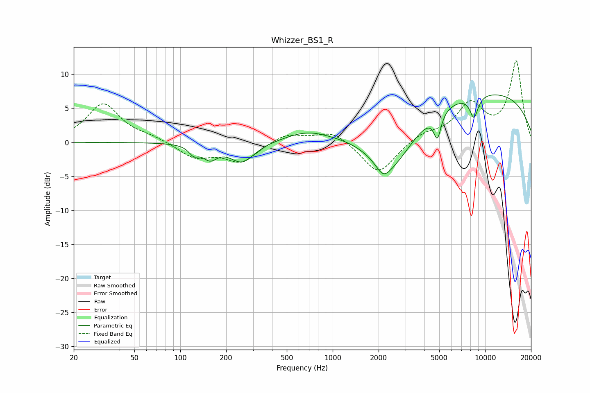

# Whizzer_BS1_R
See [usage instructions](https://github.com/jaakkopasanen/AutoEq#usage) for more options and info.

### Parametric EQs
Apply preamp of -7.1 dB when using parametric equalizer.

|   # | Type    |   Fc (Hz) |    Q |   Gain (dB) |
|-----|---------|-----------|------|-------------|
|   1 | Peaking |       123 | 5.06 |        -2.1 |
|   2 | Peaking |       123 | 5.84 |         0.9 |
|   3 | Peaking |       156 | 2.94 |        -2   |
|   4 | Peaking |       255 | 1.77 |        -2.9 |
|   5 | Peaking |       675 | 1.04 |         1.3 |
|   6 | Peaking |      2143 | 3.07 |        -1.8 |
|   7 | Peaking |      2432 | 0.84 |        -8.6 |
|   8 | Peaking |      4868 | 5.86 |        -3.6 |
|   9 | Peaking |      7765 | 0.18 |         7.9 |
|  10 | Peaking |      8452 | 4.65 |        -3.2 |

### Fixed Band EQs
When using fixed band (also called graphic) equalizer, apply preamp of **-12.1 dB** (if available) and set gains manually with these parameters.

|   # | Type    |   Fc (Hz) |    Q |   Gain (dB) |
|-----|---------|-----------|------|-------------|
|   1 | Peaking |        31 | 1.41 |         5.6 |
|   2 | Peaking |        62 | 1.41 |         0.6 |
|   3 | Peaking |       125 | 1.41 |        -2.2 |
|   4 | Peaking |       250 | 1.41 |        -2.8 |
|   5 | Peaking |       500 | 1.41 |         1.4 |
|   6 | Peaking |      1000 | 1.41 |         1.8 |
|   7 | Peaking |      2000 | 1.41 |        -4.8 |
|   8 | Peaking |      4000 | 1.41 |         1.2 |
|   9 | Peaking |      8000 | 1.41 |         5.3 |
|  10 | Peaking |     16000 | 1.41 |        11.8 |

### Graphs

