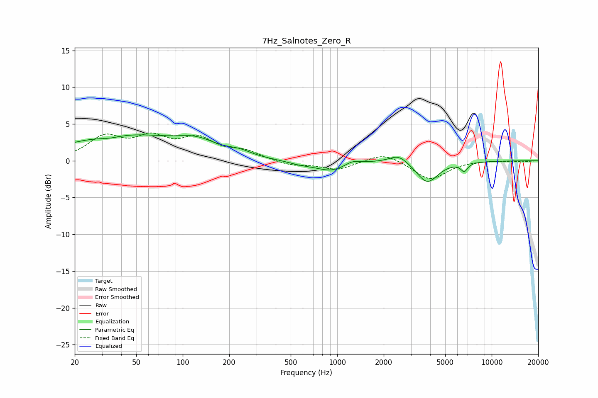

# 7Hz_Salnotes_Zero_R
See [usage instructions](https://github.com/jaakkopasanen/AutoEq#usage) for more options and info.

### Parametric EQs
Apply preamp of -3.6 dB when using parametric equalizer.

|   # | Type    |   Fc (Hz) |    Q |   Gain (dB) |
|-----|---------|-----------|------|-------------|
|   1 | Peaking |        34 | 1.92 |        -0.4 |
|   2 | Peaking |        41 | 0.39 |         3.5 |
|   3 | Peaking |       124 | 1.12 |         1.6 |
|   4 | Peaking |       234 | 1.89 |         0.6 |
|   5 | Peaking |       579 | 1.61 |        -0.4 |
|   6 | Peaking |       920 | 1.41 |        -1.3 |
|   7 | Peaking |      1259 | 2.71 |         0.6 |
|   8 | Peaking |      2504 | 2.31 |         1.2 |
|   9 | Peaking |      3828 | 2.03 |        -3   |
|  10 | Peaking |      6641 | 6    |        -1.1 |

### Fixed Band EQs
When using fixed band (also called graphic) equalizer, apply preamp of **-3.9 dB** (if available) and set gains manually with these parameters.

|   # | Type    |   Fc (Hz) |    Q |   Gain (dB) |
|-----|---------|-----------|------|-------------|
|   1 | Peaking |        31 | 1.41 |         3   |
|   2 | Peaking |        62 | 1.41 |         2.7 |
|   3 | Peaking |       125 | 1.41 |         2.7 |
|   4 | Peaking |       250 | 1.41 |         1.1 |
|   5 | Peaking |       500 | 1.41 |        -0.6 |
|   6 | Peaking |      1000 | 1.41 |        -1.2 |
|   7 | Peaking |      2000 | 1.41 |         1.2 |
|   8 | Peaking |      4000 | 1.41 |        -2.6 |
|   9 | Peaking |      8000 | 1.41 |         0.1 |
|  10 | Peaking |     16000 | 1.41 |        -0.1 |

### Graphs

