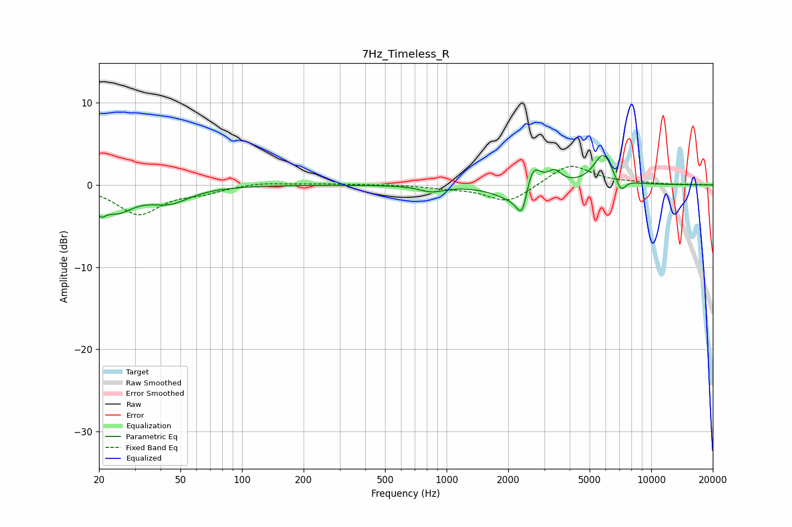

# 7Hz_Timeless_R
See [usage instructions](https://github.com/jaakkopasanen/AutoEq#usage) for more options and info.

### Parametric EQs
Apply preamp of -3.7 dB when using parametric equalizer.

|   # | Type    |   Fc (Hz) |    Q |   Gain (dB) |
|-----|---------|-----------|------|-------------|
|   1 | Peaking |        20 | 5.67 |        -1.6 |
|   2 | Peaking |        24 | 1.69 |        -2.8 |
|   3 | Peaking |        44 | 1.41 |        -1.9 |
|   4 | Peaking |       845 | 2.39 |        -0.7 |
|   5 | Peaking |      2115 | 1.6  |        -1.8 |
|   6 | Peaking |      2344 | 5.09 |        -3.7 |
|   7 | Peaking |      2622 | 3.6  |         3.8 |
|   8 | Peaking |      3373 | 4.27 |         1.5 |
|   9 | Peaking |      5834 | 2.95 |         3.8 |
|  10 | Peaking |      7098 | 5.78 |        -1.7 |

### Fixed Band EQs
When using fixed band (also called graphic) equalizer, apply preamp of **-2.3 dB** (if available) and set gains manually with these parameters.

|   # | Type    |   Fc (Hz) |    Q |   Gain (dB) |
|-----|---------|-----------|------|-------------|
|   1 | Peaking |        31 | 1.41 |        -3.5 |
|   2 | Peaking |        62 | 1.41 |        -0.8 |
|   3 | Peaking |       125 | 1.41 |         0.3 |
|   4 | Peaking |       250 | 1.41 |         0.1 |
|   5 | Peaking |       500 | 1.41 |         0.1 |
|   6 | Peaking |      1000 | 1.41 |        -0.3 |
|   7 | Peaking |      2000 | 1.41 |        -2.2 |
|   8 | Peaking |      4000 | 1.41 |         2.6 |
|   9 | Peaking |      8000 | 1.41 |         0.2 |
|  10 | Peaking |     16000 | 1.41 |         0   |

### Graphs

