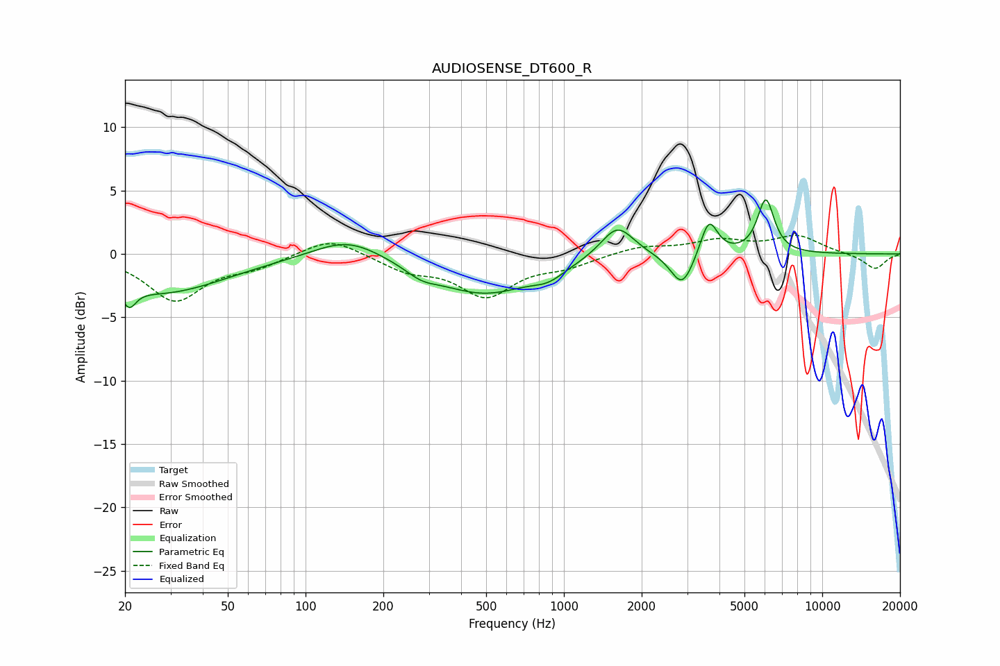

# AUDIOSENSE_DT600_R
See [usage instructions](https://github.com/jaakkopasanen/AutoEq#usage) for more options and info.

### Parametric EQs
Apply preamp of -4.4 dB when using parametric equalizer.

|   # | Type    |   Fc (Hz) |    Q |   Gain (dB) |
|-----|---------|-----------|------|-------------|
|   1 | Peaking |        21 | 5.58 |        -1.5 |
|   2 | Peaking |        28 | 0.57 |        -3   |
|   3 | Peaking |       146 | 1.08 |         1.6 |
|   4 | Peaking |       281 | 2.26 |        -0.7 |
|   5 | Peaking |       491 | 0.73 |        -3.1 |
|   6 | Peaking |       873 | 2.29 |        -0.8 |
|   7 | Peaking |      1611 | 2.2  |         2.6 |
|   8 | Peaking |      2873 | 3.13 |        -2.8 |
|   9 | Peaking |      3641 | 4.25 |         2.9 |
|  10 | Peaking |      6048 | 4.29 |         4.2 |

### Fixed Band EQs
When using fixed band (also called graphic) equalizer, apply preamp of **-1.6 dB** (if available) and set gains manually with these parameters.

|   # | Type    |   Fc (Hz) |    Q |   Gain (dB) |
|-----|---------|-----------|------|-------------|
|   1 | Peaking |        31 | 1.41 |        -3.6 |
|   2 | Peaking |        62 | 1.41 |        -0.9 |
|   3 | Peaking |       125 | 1.41 |         1.4 |
|   4 | Peaking |       250 | 1.41 |        -1.2 |
|   5 | Peaking |       500 | 1.41 |        -3.2 |
|   6 | Peaking |      1000 | 1.41 |        -0.8 |
|   7 | Peaking |      2000 | 1.41 |         0.6 |
|   8 | Peaking |      4000 | 1.41 |         1   |
|   9 | Peaking |      8000 | 1.41 |         1.4 |
|  10 | Peaking |     16000 | 1.41 |        -1.2 |

### Graphs

