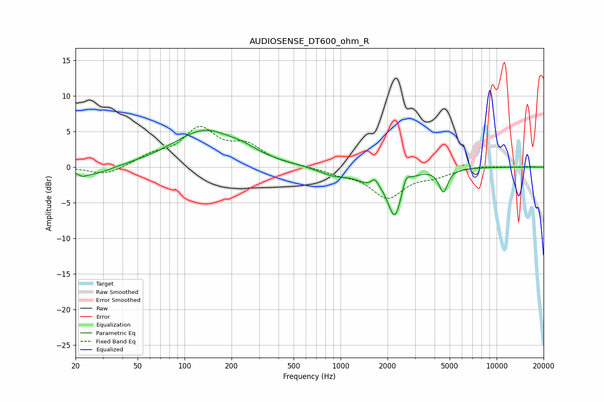

# AUDIOSENSE_DT600_ohm_R
See [usage instructions](https://github.com/jaakkopasanen/AutoEq#usage) for more options and info.

### Parametric EQs
Apply preamp of -5.3 dB when using parametric equalizer.

|   # | Type    |   Fc (Hz) |    Q |   Gain (dB) |
|-----|---------|-----------|------|-------------|
|   1 | Peaking |        22 | 5.44 |        -0.5 |
|   2 | Peaking |        26 | 1.21 |        -1.3 |
|   3 | Peaking |       136 | 0.69 |         5.1 |
|   4 | Peaking |       242 | 1.67 |         0.6 |
|   5 | Peaking |       901 | 1.44 |        -1.1 |
|   6 | Peaking |      1534 | 1.77 |        -1.6 |
|   7 | Peaking |      1654 | 6    |         1.2 |
|   8 | Peaking |      2227 | 3.2  |        -6.4 |
|   9 | Peaking |      2627 | 5.89 |         1.6 |
|  10 | Peaking |      4558 | 5.1  |        -3.2 |

### Fixed Band EQs
When using fixed band (also called graphic) equalizer, apply preamp of **-5.8 dB** (if available) and set gains manually with these parameters.

|   # | Type    |   Fc (Hz) |    Q |   Gain (dB) |
|-----|---------|-----------|------|-------------|
|   1 | Peaking |        31 | 1.41 |        -1.2 |
|   2 | Peaking |        62 | 1.41 |         1.4 |
|   3 | Peaking |       125 | 1.41 |         5   |
|   4 | Peaking |       250 | 1.41 |         2.7 |
|   5 | Peaking |       500 | 1.41 |         0.1 |
|   6 | Peaking |      1000 | 1.41 |        -0.7 |
|   7 | Peaking |      2000 | 1.41 |        -4.1 |
|   8 | Peaking |      4000 | 1.41 |        -1   |
|   9 | Peaking |      8000 | 1.41 |         0.2 |
|  10 | Peaking |     16000 | 1.41 |         0.1 |

### Graphs

