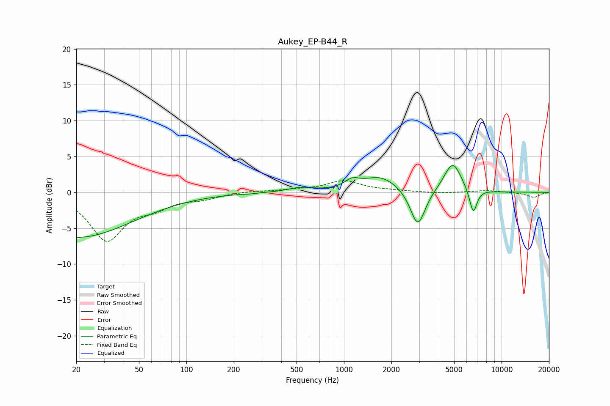

# Aukey_EP-B44_R
See [usage instructions](https://github.com/jaakkopasanen/AutoEq#usage) for more options and info.

### Parametric EQs
Apply preamp of -3.8 dB when using parametric equalizer.

|   # | Type    |   Fc (Hz) |    Q |   Gain (dB) |
|-----|---------|-----------|------|-------------|
|   1 | Peaking |        20 | 0.39 |        -6.3 |
|   2 | Peaking |       247 | 4.47 |        -0.1 |
|   3 | Peaking |       527 | 1.81 |         0.6 |
|   4 | Peaking |      1126 | 3.05 |         1.1 |
|   5 | Peaking |      1712 | 1.25 |         2.2 |
|   6 | Peaking |      2941 | 2.97 |        -5.3 |
|   7 | Peaking |      4848 | 2.74 |        -0.7 |
|   8 | Peaking |      4888 | 2.53 |         4.9 |
|   9 | Peaking |      6414 | 3.93 |        -0.3 |
|  10 | Peaking |      6617 | 5.78 |        -3.3 |

### Fixed Band EQs
When using fixed band (also called graphic) equalizer, apply preamp of **-1.7 dB** (if available) and set gains manually with these parameters.

|   # | Type    |   Fc (Hz) |    Q |   Gain (dB) |
|-----|---------|-----------|------|-------------|
|   1 | Peaking |        31 | 1.41 |        -6.5 |
|   2 | Peaking |        62 | 1.41 |        -1.6 |
|   3 | Peaking |       125 | 1.41 |        -0.7 |
|   4 | Peaking |       250 | 1.41 |         0.2 |
|   5 | Peaking |       500 | 1.41 |         0.3 |
|   6 | Peaking |      1000 | 1.41 |         1.6 |
|   7 | Peaking |      2000 | 1.41 |         0.2 |
|   8 | Peaking |      4000 | 1.41 |        -0.1 |
|   9 | Peaking |      8000 | 1.41 |         0.3 |
|  10 | Peaking |     16000 | 1.41 |        -0.7 |

### Graphs

