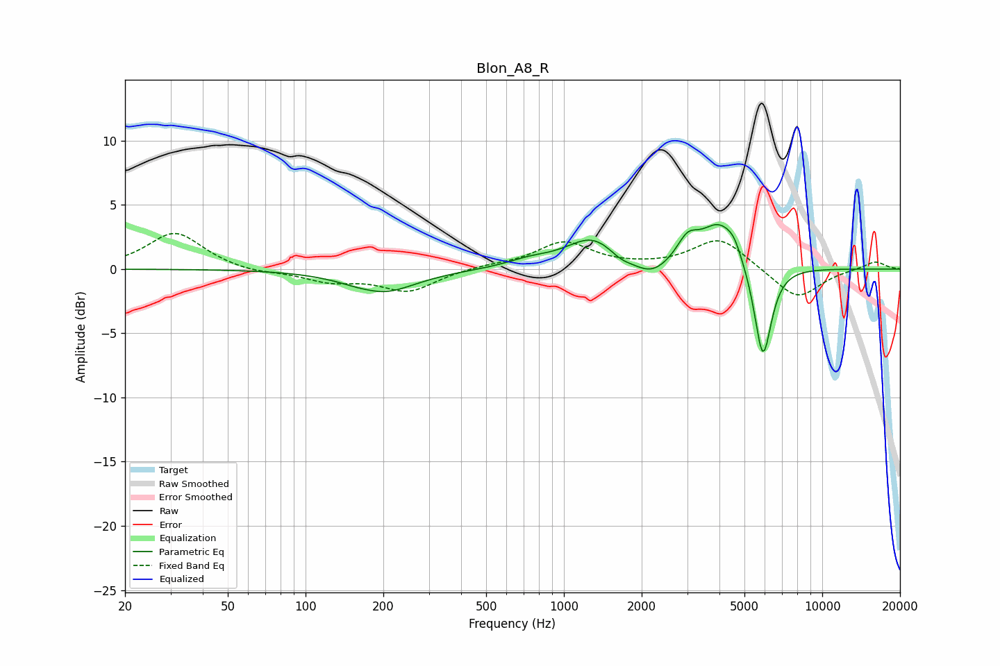

# Blon_A8_R
See [usage instructions](https://github.com/jaakkopasanen/AutoEq#usage) for more options and info.

### Parametric EQs
Apply preamp of -3.6 dB when using parametric equalizer.

|   # | Type    |   Fc (Hz) |    Q |   Gain (dB) |
|-----|---------|-----------|------|-------------|
|   1 | Peaking |       179 | 3.74 |         0.1 |
|   2 | Peaking |       196 | 1.09 |        -1.8 |
|   3 | Peaking |       734 | 1.63 |         0.5 |
|   4 | Peaking |      1291 | 1.38 |         2.4 |
|   5 | Peaking |      1655 | 3.18 |        -0.5 |
|   6 | Peaking |      2179 | 1.99 |        -1.3 |
|   7 | Peaking |      3010 | 3.39 |         1.7 |
|   8 | Peaking |      4008 | 1.85 |         3.5 |
|   9 | Peaking |      4554 | 5.07 |         0.7 |
|  10 | Peaking |      5892 | 4.06 |        -7.6 |

### Fixed Band EQs
When using fixed band (also called graphic) equalizer, apply preamp of **-2.9 dB** (if available) and set gains manually with these parameters.

|   # | Type    |   Fc (Hz) |    Q |   Gain (dB) |
|-----|---------|-----------|------|-------------|
|   1 | Peaking |        31 | 1.41 |         2.9 |
|   2 | Peaking |        62 | 1.41 |        -0.3 |
|   3 | Peaking |       125 | 1.41 |        -0.9 |
|   4 | Peaking |       250 | 1.41 |        -1.7 |
|   5 | Peaking |       500 | 1.41 |         0.2 |
|   6 | Peaking |      1000 | 1.41 |         2.1 |
|   7 | Peaking |      2000 | 1.41 |         0.1 |
|   8 | Peaking |      4000 | 1.41 |         2.4 |
|   9 | Peaking |      8000 | 1.41 |        -2.4 |
|  10 | Peaking |     16000 | 1.41 |         0.6 |

### Graphs

