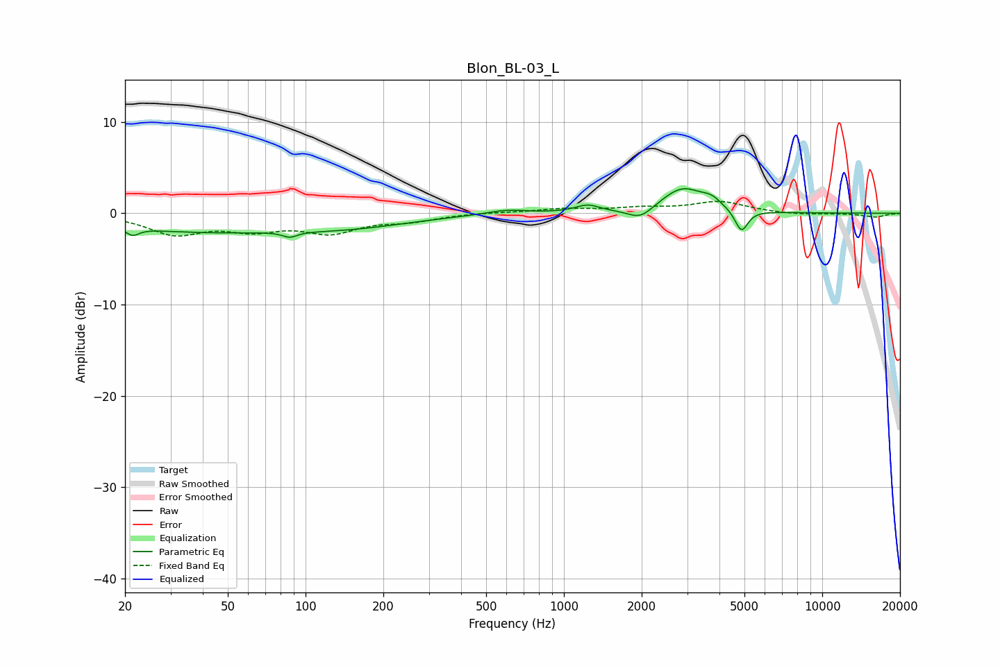

# Blon_BL-03_L
See [usage instructions](https://github.com/jaakkopasanen/AutoEq#usage) for more options and info.

### Parametric EQs
Apply preamp of -2.8 dB when using parametric equalizer.

|   # | Type    |   Fc (Hz) |    Q |   Gain (dB) |
|-----|---------|-----------|------|-------------|
|   1 | Peaking |        21 | 5.83 |        -0.8 |
|   2 | Peaking |        37 | 0.39 |        -1.9 |
|   3 | Peaking |        87 | 5.07 |        -0.6 |
|   4 | Peaking |       149 | 0.58 |        -1.2 |
|   5 | Peaking |       600 | 1.73 |         0.5 |
|   6 | Peaking |      1234 | 3.01 |         0.8 |
|   7 | Peaking |      1979 | 2.89 |        -1.3 |
|   8 | Peaking |      2878 | 1.69 |         2.8 |
|   9 | Peaking |      3733 | 3.83 |         0.8 |
|  10 | Peaking |      4867 | 5.59 |        -2.5 |

### Fixed Band EQs
When using fixed band (also called graphic) equalizer, apply preamp of **-1.4 dB** (if available) and set gains manually with these parameters.

|   # | Type    |   Fc (Hz) |    Q |   Gain (dB) |
|-----|---------|-----------|------|-------------|
|   1 | Peaking |        31 | 1.41 |        -2.1 |
|   2 | Peaking |        62 | 1.41 |        -1.5 |
|   3 | Peaking |       125 | 1.41 |        -1.9 |
|   4 | Peaking |       250 | 1.41 |        -0.7 |
|   5 | Peaking |       500 | 1.41 |         0.1 |
|   6 | Peaking |      1000 | 1.41 |         0.4 |
|   7 | Peaking |      2000 | 1.41 |         0.5 |
|   8 | Peaking |      4000 | 1.41 |         1.2 |
|   9 | Peaking |      8000 | 1.41 |        -0.2 |
|  10 | Peaking |     16000 | 1.41 |        -0.4 |

### Graphs

