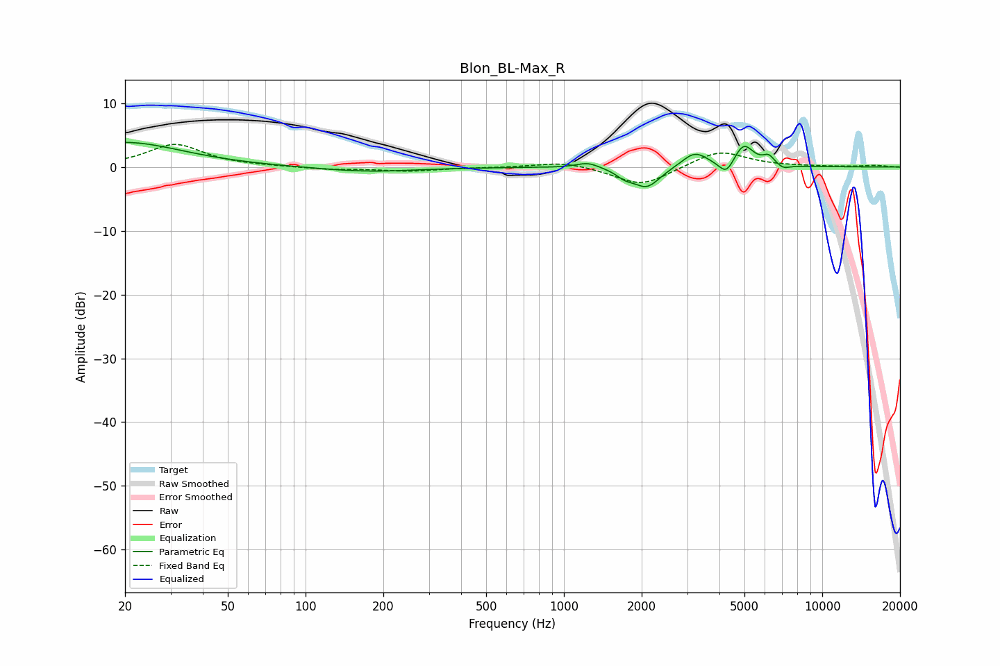

# Blon_BL-Max_R
See [usage instructions](https://github.com/jaakkopasanen/AutoEq#usage) for more options and info.

### Parametric EQs
Apply preamp of -3.9 dB when using parametric equalizer.

|   # | Type    |   Fc (Hz) |    Q |   Gain (dB) |
|-----|---------|-----------|------|-------------|
|   1 | Peaking |        20 | 0.65 |         3.9 |
|   2 | Peaking |       174 | 0.76 |        -0.8 |
|   3 | Peaking |      1238 | 3.19 |         0.9 |
|   4 | Peaking |      1718 | 4.38 |        -1   |
|   5 | Peaking |      2091 | 2.7  |        -3.2 |
|   6 | Peaking |      3212 | 2.82 |         2.4 |
|   7 | Peaking |      4254 | 5.05 |        -2.2 |
|   8 | Peaking |      4968 | 3.71 |         3.5 |
|   9 | Peaking |      6205 | 6    |         1.4 |
|  10 | Peaking |      7068 | 5.5  |        -0.7 |

### Fixed Band EQs
When using fixed band (also called graphic) equalizer, apply preamp of **-3.6 dB** (if available) and set gains manually with these parameters.

|   # | Type    |   Fc (Hz) |    Q |   Gain (dB) |
|-----|---------|-----------|------|-------------|
|   1 | Peaking |        31 | 1.41 |         3.5 |
|   2 | Peaking |        62 | 1.41 |         0.1 |
|   3 | Peaking |       125 | 1.41 |        -0.4 |
|   4 | Peaking |       250 | 1.41 |        -0.6 |
|   5 | Peaking |       500 | 1.41 |        -0.1 |
|   6 | Peaking |      1000 | 1.41 |         0.9 |
|   7 | Peaking |      2000 | 1.41 |        -3   |
|   8 | Peaking |      4000 | 1.41 |         2.7 |
|   9 | Peaking |      8000 | 1.41 |         0.1 |
|  10 | Peaking |     16000 | 1.41 |         0.2 |

### Graphs

