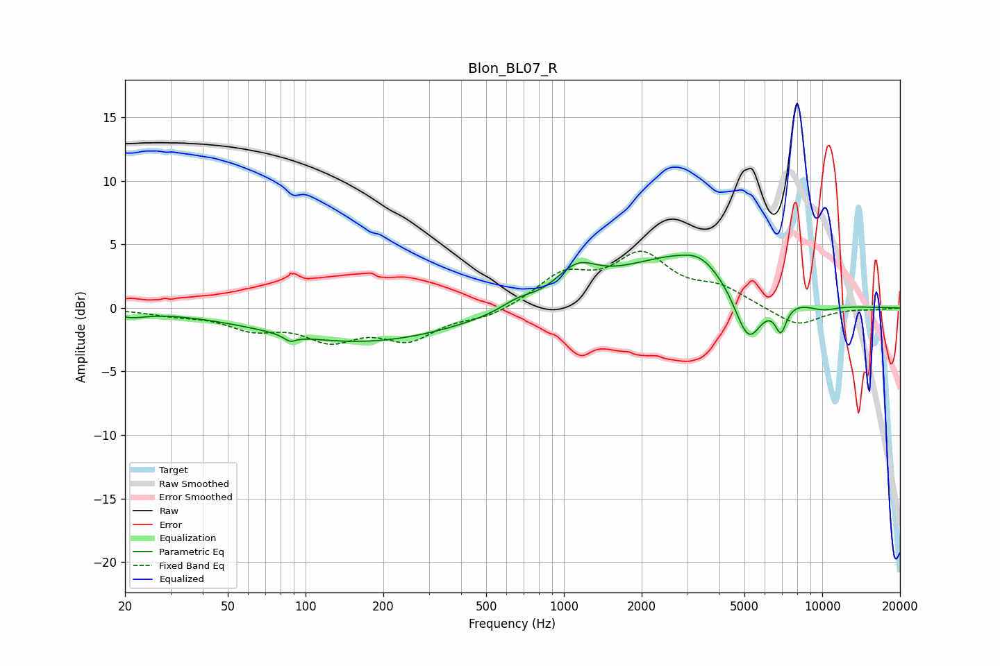

# Blon_BL07_R
See [usage instructions](https://github.com/jaakkopasanen/AutoEq#usage) for more options and info.

### Parametric EQs
Apply preamp of -4.3 dB when using parametric equalizer.

|   # | Type    |   Fc (Hz) |    Q |   Gain (dB) |
|-----|---------|-----------|------|-------------|
|   1 | Peaking |        21 | 2.43 |        -0.5 |
|   2 | Peaking |        87 | 5.78 |        -0.5 |
|   3 | Peaking |       164 | 0.37 |        -2.7 |
|   4 | Peaking |       662 | 2.29 |         0.6 |
|   5 | Peaking |      1122 | 1.78 |         2.2 |
|   6 | Peaking |      2804 | 0.57 |         4   |
|   7 | Peaking |      3366 | 2.15 |         0.8 |
|   8 | Peaking |      5168 | 2.51 |        -4.5 |
|   9 | Peaking |      6915 | 5.98 |        -2.2 |
|  10 | Peaking |     10000 | 1.91 |        -0.5 |

### Fixed Band EQs
When using fixed band (also called graphic) equalizer, apply preamp of **-4.6 dB** (if available) and set gains manually with these parameters.

|   # | Type    |   Fc (Hz) |    Q |   Gain (dB) |
|-----|---------|-----------|------|-------------|
|   1 | Peaking |        31 | 1.41 |        -0.4 |
|   2 | Peaking |        62 | 1.41 |        -1.4 |
|   3 | Peaking |       125 | 1.41 |        -2.2 |
|   4 | Peaking |       250 | 1.41 |        -2.2 |
|   5 | Peaking |       500 | 1.41 |        -0.7 |
|   6 | Peaking |      1000 | 1.41 |         2.4 |
|   7 | Peaking |      2000 | 1.41 |         3.9 |
|   8 | Peaking |      4000 | 1.41 |         1.4 |
|   9 | Peaking |      8000 | 1.41 |        -1.5 |
|  10 | Peaking |     16000 | 1.41 |        -0.1 |

### Graphs

