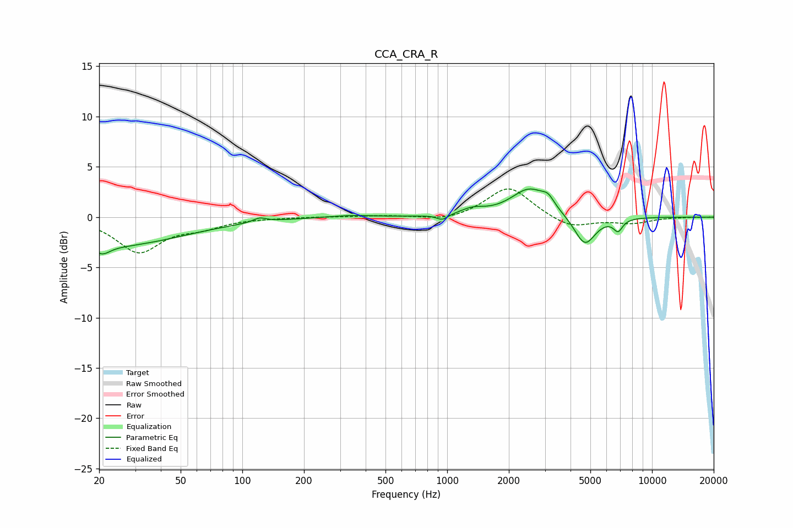

# CCA_CRA_R
See [usage instructions](https://github.com/jaakkopasanen/AutoEq#usage) for more options and info.

### Parametric EQs
Apply preamp of -2.9 dB when using parametric equalizer.

|   # | Type    |   Fc (Hz) |    Q |   Gain (dB) |
|-----|---------|-----------|------|-------------|
|   1 | Peaking |        21 | 3.93 |        -0.8 |
|   2 | Peaking |        22 | 0.39 |        -2.9 |
|   3 | Peaking |       121 | 4.5  |         0.4 |
|   4 | Peaking |       339 | 1.37 |         0.2 |
|   5 | Peaking |       947 | 5.21 |        -0.5 |
|   6 | Peaking |      1329 | 2.45 |         0.6 |
|   7 | Peaking |      2528 | 1.57 |         2.8 |
|   8 | Peaking |      3110 | 4.88 |         0.8 |
|   9 | Peaking |      4699 | 2.7  |        -3   |
|  10 | Peaking |      6828 | 6    |        -1.2 |

### Fixed Band EQs
When using fixed band (also called graphic) equalizer, apply preamp of **-2.9 dB** (if available) and set gains manually with these parameters.

|   # | Type    |   Fc (Hz) |    Q |   Gain (dB) |
|-----|---------|-----------|------|-------------|
|   1 | Peaking |        31 | 1.41 |        -3.4 |
|   2 | Peaking |        62 | 1.41 |        -0.9 |
|   3 | Peaking |       125 | 1.41 |        -0   |
|   4 | Peaking |       250 | 1.41 |         0   |
|   5 | Peaking |       500 | 1.41 |         0.1 |
|   6 | Peaking |      1000 | 1.41 |        -0.4 |
|   7 | Peaking |      2000 | 1.41 |         3.1 |
|   8 | Peaking |      4000 | 1.41 |        -1.2 |
|   9 | Peaking |      8000 | 1.41 |        -0.6 |
|  10 | Peaking |     16000 | 1.41 |         0   |

### Graphs

