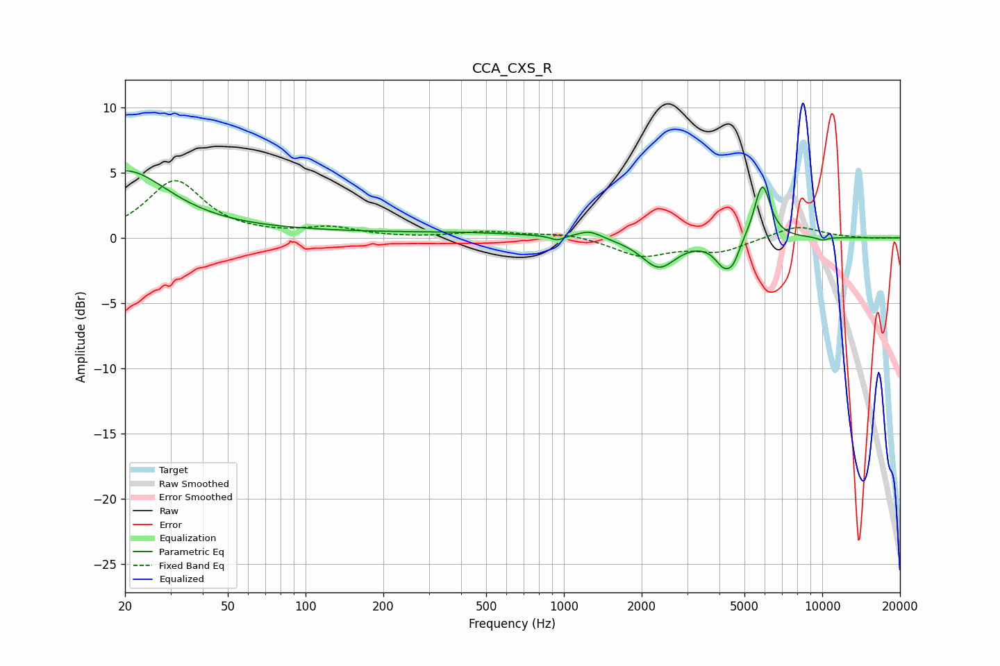

# CCA_CXS_R
See [usage instructions](https://github.com/jaakkopasanen/AutoEq#usage) for more options and info.

### Parametric EQs
Apply preamp of -5.2 dB when using parametric equalizer.

|   # | Type    |   Fc (Hz) |    Q |   Gain (dB) |
|-----|---------|-----------|------|-------------|
|   1 | Peaking |        20 | 0.87 |         4.7 |
|   2 | Peaking |        44 | 0.18 |         0.5 |
|   3 | Peaking |       447 | 0.59 |         0.3 |
|   4 | Peaking |       941 | 5.51 |        -0.4 |
|   5 | Peaking |      1259 | 3.05 |         0.6 |
|   6 | Peaking |      2333 | 2.14 |        -2.3 |
|   7 | Peaking |      4195 | 3.64 |        -2   |
|   8 | Peaking |      4543 | 6    |        -0.9 |
|   9 | Peaking |      5863 | 4.43 |         4.3 |
|  10 | Peaking |      9998 | 5.97 |        -0.2 |

### Fixed Band EQs
When using fixed band (also called graphic) equalizer, apply preamp of **-4.5 dB** (if available) and set gains manually with these parameters.

|   # | Type    |   Fc (Hz) |    Q |   Gain (dB) |
|-----|---------|-----------|------|-------------|
|   1 | Peaking |        31 | 1.41 |         4.3 |
|   2 | Peaking |        62 | 1.41 |         0.1 |
|   3 | Peaking |       125 | 1.41 |         0.7 |
|   4 | Peaking |       250 | 1.41 |        -0   |
|   5 | Peaking |       500 | 1.41 |         0.4 |
|   6 | Peaking |      1000 | 1.41 |         0.4 |
|   7 | Peaking |      2000 | 1.41 |        -1.4 |
|   8 | Peaking |      4000 | 1.41 |        -1   |
|   9 | Peaking |      8000 | 1.41 |         1   |
|  10 | Peaking |     16000 | 1.41 |        -0.1 |

### Graphs

