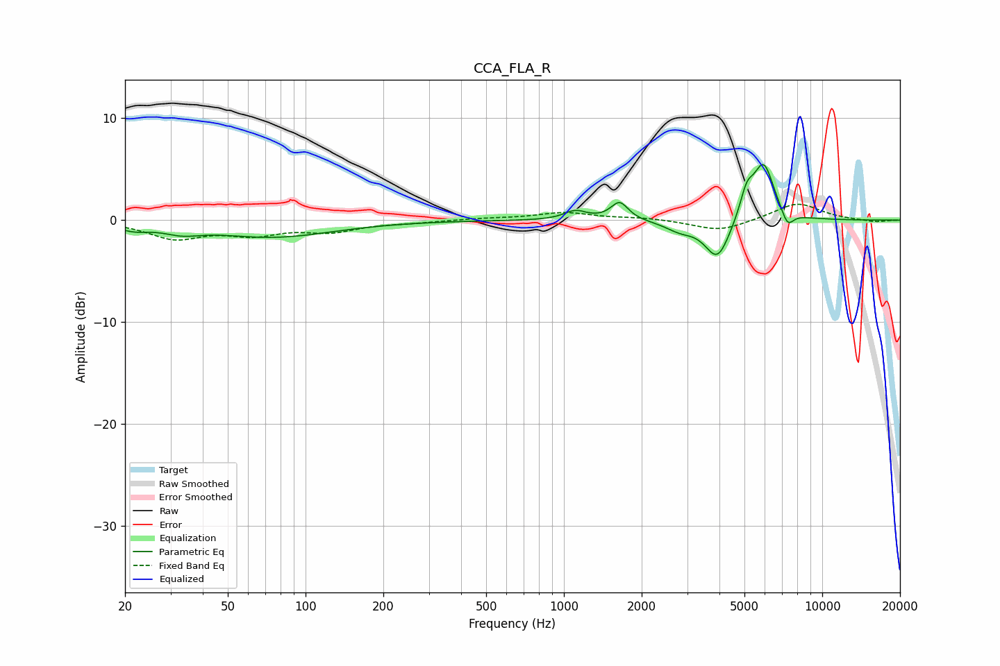

# CCA_FLA_R
See [usage instructions](https://github.com/jaakkopasanen/AutoEq#usage) for more options and info.

### Parametric EQs
Apply preamp of -5.6 dB when using parametric equalizer.

|   # | Type    |   Fc (Hz) |    Q |   Gain (dB) |
|-----|---------|-----------|------|-------------|
|   1 | Peaking |        22 | 2.36 |        -0.6 |
|   2 | Peaking |        33 | 2    |        -0.7 |
|   3 | Peaking |        75 | 0.6  |        -1.6 |
|   4 | Peaking |      1109 | 3.23 |         0.9 |
|   5 | Peaking |      1642 | 4.19 |         1.8 |
|   6 | Peaking |      2818 | 2.48 |        -0.9 |
|   7 | Peaking |      3931 | 2.91 |        -3.9 |
|   8 | Peaking |      5102 | 5.23 |         2.4 |
|   9 | Peaking |      5931 | 3.34 |         5.5 |
|  10 | Peaking |      7338 | 5.83 |        -1.5 |

### Fixed Band EQs
When using fixed band (also called graphic) equalizer, apply preamp of **-1.7 dB** (if available) and set gains manually with these parameters.

|   # | Type    |   Fc (Hz) |    Q |   Gain (dB) |
|-----|---------|-----------|------|-------------|
|   1 | Peaking |        31 | 1.41 |        -1.7 |
|   2 | Peaking |        62 | 1.41 |        -1.2 |
|   3 | Peaking |       125 | 1.41 |        -1   |
|   4 | Peaking |       250 | 1.41 |        -0.2 |
|   5 | Peaking |       500 | 1.41 |         0.2 |
|   6 | Peaking |      1000 | 1.41 |         0.7 |
|   7 | Peaking |      2000 | 1.41 |         0.2 |
|   8 | Peaking |      4000 | 1.41 |        -1.1 |
|   9 | Peaking |      8000 | 1.41 |         1.7 |
|  10 | Peaking |     16000 | 1.41 |        -0.2 |

### Graphs

