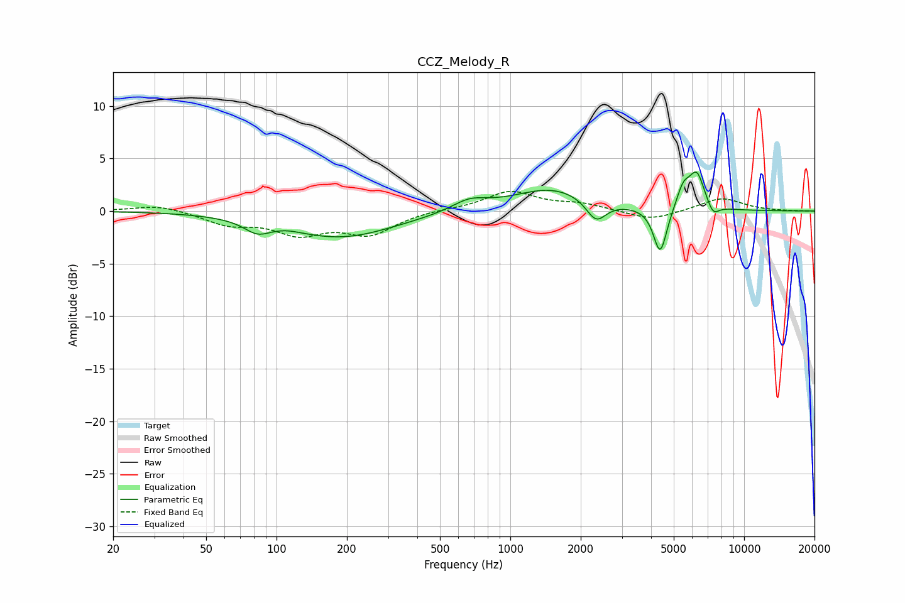

# CCZ_Melody_R
See [usage instructions](https://github.com/jaakkopasanen/AutoEq#usage) for more options and info.

### Parametric EQs
Apply preamp of -3.8 dB when using parametric equalizer.

|   # | Type    |   Fc (Hz) |    Q |   Gain (dB) |
|-----|---------|-----------|------|-------------|
|   1 | Peaking |        83 | 2.59 |        -1.1 |
|   2 | Peaking |       111 | 2.76 |         0.1 |
|   3 | Peaking |       187 | 0.6  |        -2.5 |
|   4 | Peaking |       669 | 1.85 |         1   |
|   5 | Peaking |      1516 | 0.83 |         2.2 |
|   6 | Peaking |      2327 | 3.28 |        -2.1 |
|   7 | Peaking |      4377 | 4.91 |        -4.5 |
|   8 | Peaking |      5494 | 4.77 |         2   |
|   9 | Peaking |      6274 | 4.17 |         3.3 |
|  10 | Peaking |      7374 | 5.64 |        -1.1 |

### Fixed Band EQs
When using fixed band (also called graphic) equalizer, apply preamp of **-2.0 dB** (if available) and set gains manually with these parameters.

|   # | Type    |   Fc (Hz) |    Q |   Gain (dB) |
|-----|---------|-----------|------|-------------|
|   1 | Peaking |        31 | 1.41 |         0.6 |
|   2 | Peaking |        62 | 1.41 |        -1.2 |
|   3 | Peaking |       125 | 1.41 |        -2   |
|   4 | Peaking |       250 | 1.41 |        -2.1 |
|   5 | Peaking |       500 | 1.41 |         0.1 |
|   6 | Peaking |      1000 | 1.41 |         1.8 |
|   7 | Peaking |      2000 | 1.41 |         0.6 |
|   8 | Peaking |      4000 | 1.41 |        -0.9 |
|   9 | Peaking |      8000 | 1.41 |         1.3 |
|  10 | Peaking |     16000 | 1.41 |        -0   |

### Graphs

