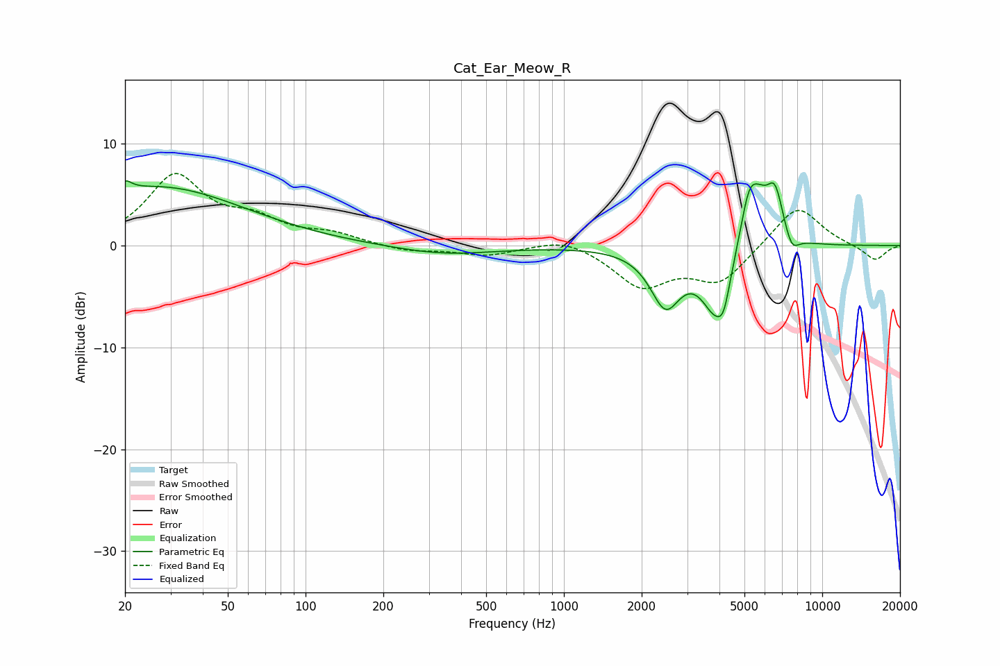

# Cat_Ear_Meow_R
See [usage instructions](https://github.com/jaakkopasanen/AutoEq#usage) for more options and info.

### Parametric EQs
Apply preamp of -6.4 dB when using parametric equalizer.

|   # | Type    |   Fc (Hz) |    Q |   Gain (dB) |
|-----|---------|-----------|------|-------------|
|   1 | Peaking |        20 | 5.72 |         1   |
|   2 | Peaking |        27 | 0.42 |         5.7 |
|   3 | Peaking |       344 | 0.72 |        -0.9 |
|   4 | Peaking |      2473 | 2.39 |        -5.5 |
|   5 | Peaking |      3857 | 2.45 |        -5.9 |
|   6 | Peaking |      4157 | 5.79 |        -2.4 |
|   7 | Peaking |      5189 | 4.13 |         4   |
|   8 | Peaking |      5666 | 2.83 |         3.7 |
|   9 | Peaking |      6572 | 4.15 |         4.6 |
|  10 | Peaking |      7618 | 4.86 |        -1.7 |

### Fixed Band EQs
When using fixed band (also called graphic) equalizer, apply preamp of **-7.2 dB** (if available) and set gains manually with these parameters.

|   # | Type    |   Fc (Hz) |    Q |   Gain (dB) |
|-----|---------|-----------|------|-------------|
|   1 | Peaking |        31 | 1.41 |         6.6 |
|   2 | Peaking |        62 | 1.41 |         2.1 |
|   3 | Peaking |       125 | 1.41 |         1   |
|   4 | Peaking |       250 | 1.41 |        -0.6 |
|   5 | Peaking |       500 | 1.41 |        -0.9 |
|   6 | Peaking |      1000 | 1.41 |         0.9 |
|   7 | Peaking |      2000 | 1.41 |        -3.8 |
|   8 | Peaking |      4000 | 1.41 |        -3.5 |
|   9 | Peaking |      8000 | 1.41 |         4.1 |
|  10 | Peaking |     16000 | 1.41 |        -1.5 |

### Graphs

