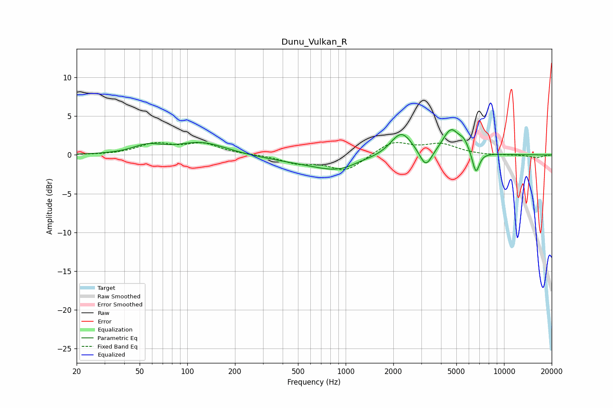

# Dunu_Vulkan_R
See [usage instructions](https://github.com/jaakkopasanen/AutoEq#usage) for more options and info.

### Parametric EQs
Apply preamp of -3.3 dB when using parametric equalizer.

|   # | Type    |   Fc (Hz) |    Q |   Gain (dB) |
|-----|---------|-----------|------|-------------|
|   1 | Peaking |        56 | 1.6  |         1   |
|   2 | Peaking |       124 | 0.9  |         1.6 |
|   3 | Peaking |       439 | 0.58 |        -0.5 |
|   4 | Peaking |       945 | 0.82 |        -2   |
|   5 | Peaking |      1257 | 1.54 |         0.5 |
|   6 | Peaking |      2247 | 2.02 |         3.2 |
|   7 | Peaking |      3206 | 3.7  |        -2.4 |
|   8 | Peaking |      4627 | 2.64 |         3.2 |
|   9 | Peaking |      5586 | 4.51 |         1.1 |
|  10 | Peaking |      6643 | 6    |        -2.8 |

### Fixed Band EQs
When using fixed band (also called graphic) equalizer, apply preamp of **-1.7 dB** (if available) and set gains manually with these parameters.

|   # | Type    |   Fc (Hz) |    Q |   Gain (dB) |
|-----|---------|-----------|------|-------------|
|   1 | Peaking |        31 | 1.41 |        -0   |
|   2 | Peaking |        62 | 1.41 |         1.3 |
|   3 | Peaking |       125 | 1.41 |         1.3 |
|   4 | Peaking |       250 | 1.41 |         0   |
|   5 | Peaking |       500 | 1.41 |        -1   |
|   6 | Peaking |      1000 | 1.41 |        -2   |
|   7 | Peaking |      2000 | 1.41 |         1.7 |
|   8 | Peaking |      4000 | 1.41 |         1.3 |
|   9 | Peaking |      8000 | 1.41 |        -0.1 |
|  10 | Peaking |     16000 | 1.41 |        -0.4 |

### Graphs

