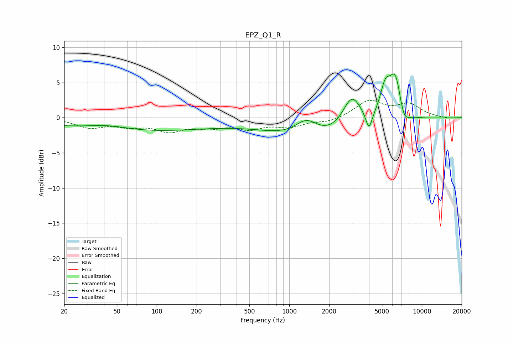

# EPZ_Q1_R
See [usage instructions](https://github.com/jaakkopasanen/AutoEq#usage) for more options and info.

### Parametric EQs
Apply preamp of -6.3 dB when using parametric equalizer.

|   # | Type    |   Fc (Hz) |    Q |   Gain (dB) |
|-----|---------|-----------|------|-------------|
|   1 | Peaking |        42 | 0.86 |         0.8 |
|   2 | Peaking |        63 | 0.18 |        -1.5 |
|   3 | Peaking |        69 | 0.37 |        -0.6 |
|   4 | Peaking |      1350 | 1.61 |         2.5 |
|   5 | Peaking |      1785 | 0.39 |        -3.4 |
|   6 | Peaking |      2970 | 1.93 |         5   |
|   7 | Peaking |      3997 | 5.96 |        -2.4 |
|   8 | Peaking |      5291 | 3.44 |         4   |
|   9 | Peaking |      6351 | 2.82 |         6.7 |
|  10 | Peaking |      7254 | 3.21 |        -2.7 |

### Fixed Band EQs
When using fixed band (also called graphic) equalizer, apply preamp of **-2.6 dB** (if available) and set gains manually with these parameters.

|   # | Type    |   Fc (Hz) |    Q |   Gain (dB) |
|-----|---------|-----------|------|-------------|
|   1 | Peaking |        31 | 1.41 |        -1.3 |
|   2 | Peaking |        62 | 1.41 |        -0.9 |
|   3 | Peaking |       125 | 1.41 |        -1.7 |
|   4 | Peaking |       250 | 1.41 |        -1.1 |
|   5 | Peaking |       500 | 1.41 |        -1.3 |
|   6 | Peaking |      1000 | 1.41 |        -1.1 |
|   7 | Peaking |      2000 | 1.41 |        -0.6 |
|   8 | Peaking |      4000 | 1.41 |         2.4 |
|   9 | Peaking |      8000 | 1.41 |         1.8 |
|  10 | Peaking |     16000 | 1.41 |        -0.1 |

### Graphs

