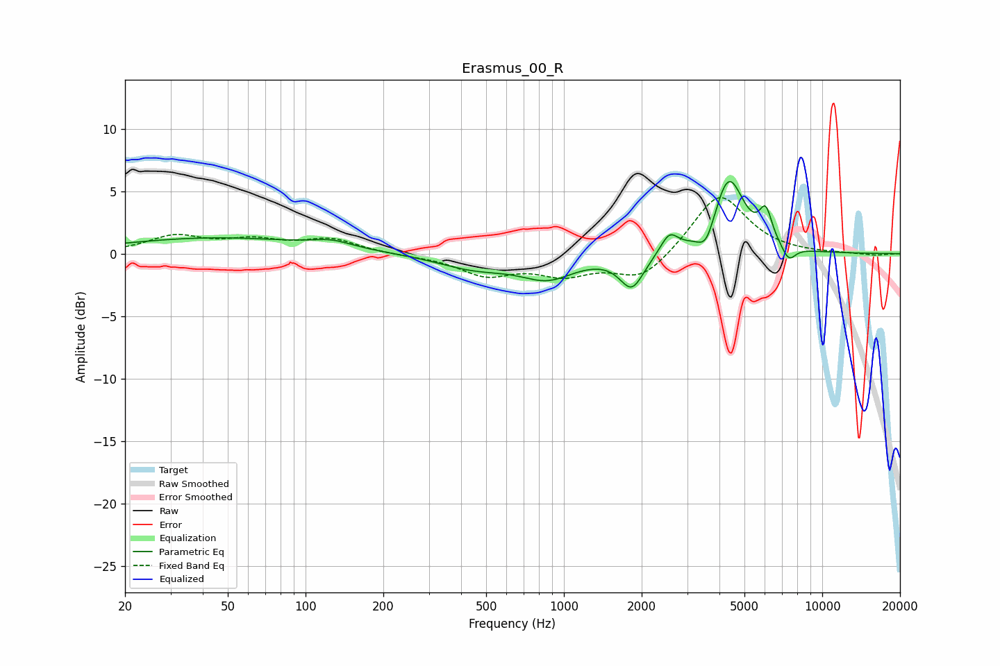

# Erasmus_00_R
See [usage instructions](https://github.com/jaakkopasanen/AutoEq#usage) for more options and info.

### Parametric EQs
Apply preamp of -5.9 dB when using parametric equalizer.

|   # | Type    |   Fc (Hz) |    Q |   Gain (dB) |
|-----|---------|-----------|------|-------------|
|   1 | Peaking |        45 | 0.39 |         1.3 |
|   2 | Peaking |       126 | 1.79 |         0.6 |
|   3 | Peaking |       451 | 0.98 |        -1.1 |
|   4 | Peaking |       865 | 1.35 |        -1.8 |
|   5 | Peaking |      1832 | 3.03 |        -2.7 |
|   6 | Peaking |      2560 | 4.23 |         1.5 |
|   7 | Peaking |      3559 | 4.2  |        -1.8 |
|   8 | Peaking |      4338 | 2.34 |         6.1 |
|   9 | Peaking |      6044 | 5.54 |         2.5 |
|  10 | Peaking |      7417 | 5.03 |        -1.2 |

### Fixed Band EQs
When using fixed band (also called graphic) equalizer, apply preamp of **-4.6 dB** (if available) and set gains manually with these parameters.

|   # | Type    |   Fc (Hz) |    Q |   Gain (dB) |
|-----|---------|-----------|------|-------------|
|   1 | Peaking |        31 | 1.41 |         1.3 |
|   2 | Peaking |        62 | 1.41 |         0.9 |
|   3 | Peaking |       125 | 1.41 |         1.1 |
|   4 | Peaking |       250 | 1.41 |        -0.1 |
|   5 | Peaking |       500 | 1.41 |        -1.6 |
|   6 | Peaking |      1000 | 1.41 |        -1.5 |
|   7 | Peaking |      2000 | 1.41 |        -2.1 |
|   8 | Peaking |      4000 | 1.41 |         4.9 |
|   9 | Peaking |      8000 | 1.41 |        -0   |
|  10 | Peaking |     16000 | 1.41 |        -0.2 |

### Graphs

