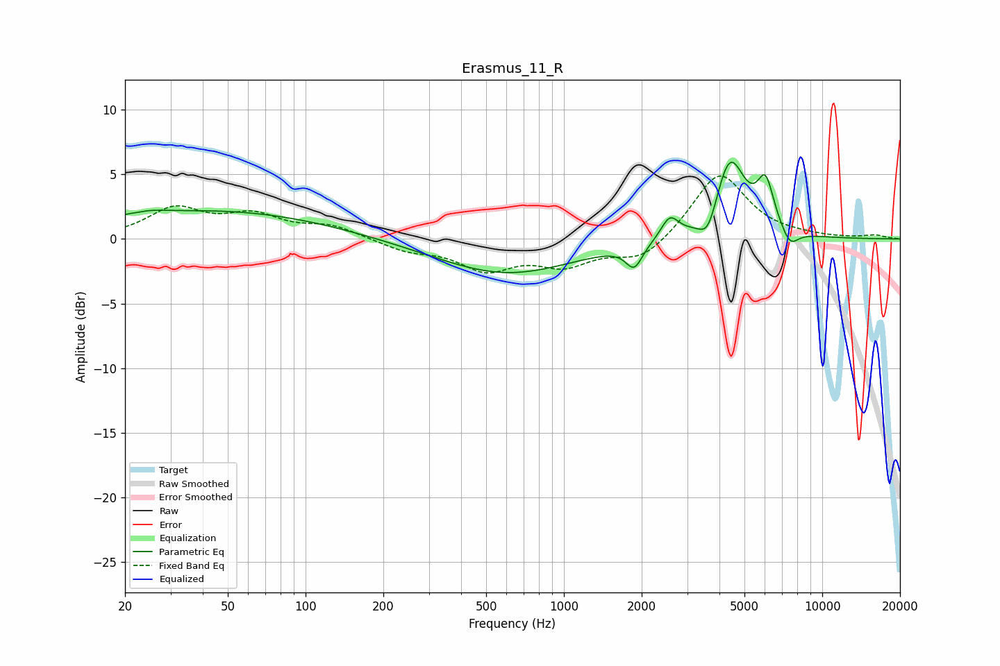

# Erasmus_11_R
See [usage instructions](https://github.com/jaakkopasanen/AutoEq#usage) for more options and info.

### Parametric EQs
Apply preamp of -6.0 dB when using parametric equalizer.

|   # | Type    |   Fc (Hz) |    Q |   Gain (dB) |
|-----|---------|-----------|------|-------------|
|   1 | Peaking |        20 | 5.38 |         0.1 |
|   2 | Peaking |        25 | 1.93 |         0.3 |
|   3 | Peaking |        45 | 0.32 |         2.2 |
|   4 | Peaking |       595 | 0.53 |        -2.7 |
|   5 | Peaking |      1871 | 4.39 |        -1.8 |
|   6 | Peaking |      2570 | 4.15 |         1.7 |
|   7 | Peaking |      3619 | 3.84 |        -2.2 |
|   8 | Peaking |      4382 | 2.32 |         6.3 |
|   9 | Peaking |      6037 | 4.23 |         3.6 |
|  10 | Peaking |      7499 | 4.13 |        -1.3 |

### Fixed Band EQs
When using fixed band (also called graphic) equalizer, apply preamp of **-5.0 dB** (if available) and set gains manually with these parameters.

|   # | Type    |   Fc (Hz) |    Q |   Gain (dB) |
|-----|---------|-----------|------|-------------|
|   1 | Peaking |        31 | 1.41 |         2.2 |
|   2 | Peaking |        62 | 1.41 |         1.6 |
|   3 | Peaking |       125 | 1.41 |         0.9 |
|   4 | Peaking |       250 | 1.41 |        -0.8 |
|   5 | Peaking |       500 | 1.41 |        -2.2 |
|   6 | Peaking |      1000 | 1.41 |        -1.8 |
|   7 | Peaking |      2000 | 1.41 |        -1.7 |
|   8 | Peaking |      4000 | 1.41 |         5.2 |
|   9 | Peaking |      8000 | 1.41 |         0.1 |
|  10 | Peaking |     16000 | 1.41 |         0.3 |

### Graphs

