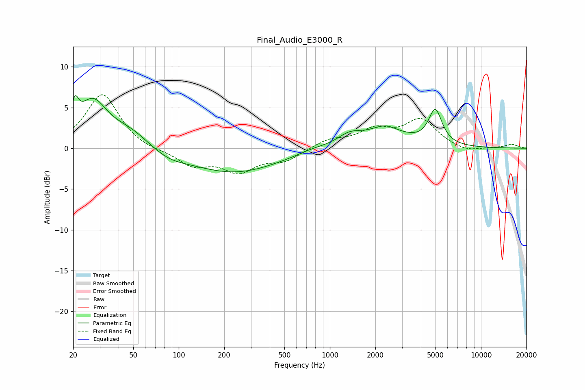

# Final_Audio_E3000_R
See [usage instructions](https://github.com/jaakkopasanen/AutoEq#usage) for more options and info.

### Parametric EQs
Apply preamp of -6.6 dB when using parametric equalizer.

|   # | Type    |   Fc (Hz) |    Q |   Gain (dB) |
|-----|---------|-----------|------|-------------|
|   1 | Peaking |        21 | 5.95 |         2.9 |
|   2 | Peaking |        27 | 1.48 |         5.3 |
|   3 | Peaking |        48 | 1.04 |         2   |
|   4 | Peaking |        85 | 1.19 |        -0.9 |
|   5 | Peaking |       233 | 0.48 |        -3   |
|   6 | Peaking |       763 | 1.44 |         0.4 |
|   7 | Peaking |      1350 | 1.65 |         1.4 |
|   8 | Peaking |      2428 | 1.19 |         2.7 |
|   9 | Peaking |      2769 | 2.02 |        -0.5 |
|  10 | Peaking |      4982 | 3.16 |         4.2 |

### Fixed Band EQs
When using fixed band (also called graphic) equalizer, apply preamp of **-6.7 dB** (if available) and set gains manually with these parameters.

|   # | Type    |   Fc (Hz) |    Q |   Gain (dB) |
|-----|---------|-----------|------|-------------|
|   1 | Peaking |        31 | 1.41 |         6.7 |
|   2 | Peaking |        62 | 1.41 |        -0.4 |
|   3 | Peaking |       125 | 1.41 |        -2   |
|   4 | Peaking |       250 | 1.41 |        -2.6 |
|   5 | Peaking |       500 | 1.41 |        -1.4 |
|   6 | Peaking |      1000 | 1.41 |         1   |
|   7 | Peaking |      2000 | 1.41 |         2   |
|   8 | Peaking |      4000 | 1.41 |         3.4 |
|   9 | Peaking |      8000 | 1.41 |        -0.6 |
|  10 | Peaking |     16000 | 1.41 |         0.5 |

### Graphs

