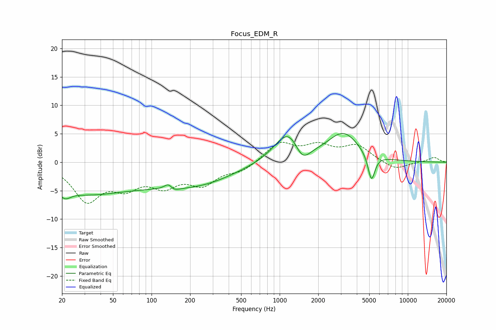

# Focus_EDM_R
See [usage instructions](https://github.com/jaakkopasanen/AutoEq#usage) for more options and info.

### Parametric EQs
Apply preamp of -5.2 dB when using parametric equalizer.

|   # | Type    |   Fc (Hz) |    Q |   Gain (dB) |
|-----|---------|-----------|------|-------------|
|   1 | Peaking |        21 | 2.79 |        -2.2 |
|   2 | Peaking |        28 | 0.64 |        -2.8 |
|   3 | Peaking |        61 | 0.38 |        -3.3 |
|   4 | Peaking |       138 | 3.8  |         4.1 |
|   5 | Peaking |       140 | 3.44 |        -3.6 |
|   6 | Peaking |       246 | 0.52 |        -3   |
|   7 | Peaking |      1181 | 1.33 |         5.9 |
|   8 | Peaking |      1497 | 2.26 |        -3.5 |
|   9 | Peaking |      3149 | 1.16 |         4.9 |
|  10 | Peaking |      5201 | 5.02 |        -4.8 |

### Fixed Band EQs
When using fixed band (also called graphic) equalizer, apply preamp of **-3.6 dB** (if available) and set gains manually with these parameters.

|   # | Type    |   Fc (Hz) |    Q |   Gain (dB) |
|-----|---------|-----------|------|-------------|
|   1 | Peaking |        31 | 1.41 |        -6.4 |
|   2 | Peaking |        62 | 1.41 |        -3.6 |
|   3 | Peaking |       125 | 1.41 |        -3.5 |
|   4 | Peaking |       250 | 1.41 |        -3.5 |
|   5 | Peaking |       500 | 1.41 |        -1.5 |
|   6 | Peaking |      1000 | 1.41 |         3.3 |
|   7 | Peaking |      2000 | 1.41 |         2.5 |
|   8 | Peaking |      4000 | 1.41 |         2.8 |
|   9 | Peaking |      8000 | 1.41 |        -1.4 |
|  10 | Peaking |     16000 | 1.41 |         0.9 |

### Graphs

