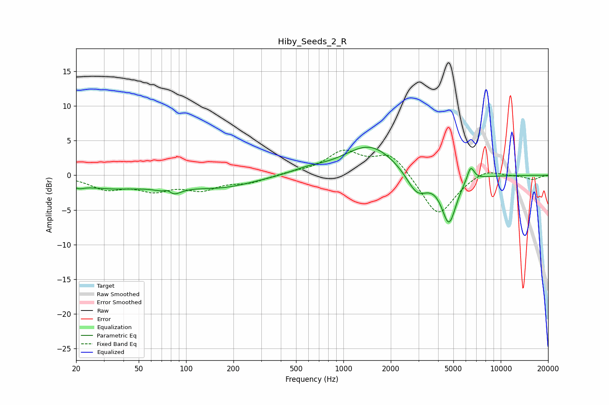

# Hiby_Seeds_2_R
See [usage instructions](https://github.com/jaakkopasanen/AutoEq#usage) for more options and info.

### Parametric EQs
Apply preamp of -4.1 dB when using parametric equalizer.

|   # | Type    |   Fc (Hz) |    Q |   Gain (dB) |
|-----|---------|-----------|------|-------------|
|   1 | Peaking |        21 | 4.68 |        -0.5 |
|   2 | Peaking |        34 | 0.51 |        -1.8 |
|   3 | Peaking |        77 | 4.51 |         1.5 |
|   4 | Peaking |        79 | 2.86 |        -2.2 |
|   5 | Peaking |       166 | 0.65 |        -1.6 |
|   6 | Peaking |       594 | 1.37 |         0.6 |
|   7 | Peaking |      1473 | 0.84 |         4.4 |
|   8 | Peaking |      2939 | 2.07 |        -3.4 |
|   9 | Peaking |      4688 | 2.98 |        -6.8 |
|  10 | Peaking |      6439 | 5.98 |         2.2 |

### Fixed Band EQs
When using fixed band (also called graphic) equalizer, apply preamp of **-3.7 dB** (if available) and set gains manually with these parameters.

|   # | Type    |   Fc (Hz) |    Q |   Gain (dB) |
|-----|---------|-----------|------|-------------|
|   1 | Peaking |        31 | 1.41 |        -1.8 |
|   2 | Peaking |        62 | 1.41 |        -1.9 |
|   3 | Peaking |       125 | 1.41 |        -1.8 |
|   4 | Peaking |       250 | 1.41 |        -0.9 |
|   5 | Peaking |       500 | 1.41 |         0.3 |
|   6 | Peaking |      1000 | 1.41 |         3.2 |
|   7 | Peaking |      2000 | 1.41 |         3.2 |
|   8 | Peaking |      4000 | 1.41 |        -6.1 |
|   9 | Peaking |      8000 | 1.41 |         1.1 |
|  10 | Peaking |     16000 | 1.41 |        -0.6 |

### Graphs

