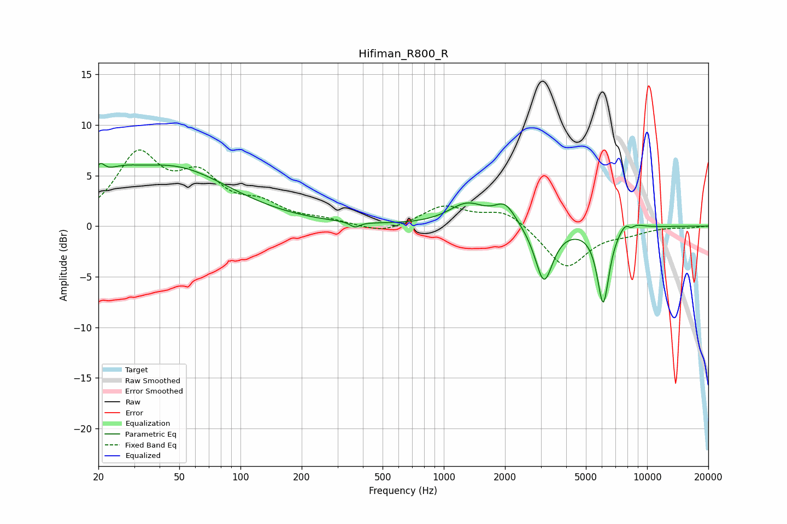

# Hifiman_R800_R
See [usage instructions](https://github.com/jaakkopasanen/AutoEq#usage) for more options and info.

### Parametric EQs
Apply preamp of -6.3 dB when using parametric equalizer.

|   # | Type    |   Fc (Hz) |    Q |   Gain (dB) |
|-----|---------|-----------|------|-------------|
|   1 | Peaking |        20 | 5.7  |         1.8 |
|   2 | Peaking |        25 | 1.39 |         1.9 |
|   3 | Peaking |        47 | 0.5  |         5.5 |
|   4 | Peaking |       366 | 5.97 |        -0.5 |
|   5 | Peaking |      1301 | 1.56 |         2.1 |
|   6 | Peaking |      2004 | 2.68 |         2   |
|   7 | Peaking |      3109 | 3.27 |        -5.6 |
|   8 | Peaking |      6083 | 4.65 |        -7.6 |
|   9 | Peaking |      8178 | 3.87 |         3   |
|  10 | Peaking |      8268 | 5.13 |        -2.4 |

### Fixed Band EQs
When using fixed band (also called graphic) equalizer, apply preamp of **-7.6 dB** (if available) and set gains manually with these parameters.

|   # | Type    |   Fc (Hz) |    Q |   Gain (dB) |
|-----|---------|-----------|------|-------------|
|   1 | Peaking |        31 | 1.41 |         6.7 |
|   2 | Peaking |        62 | 1.41 |         4.2 |
|   3 | Peaking |       125 | 1.41 |         1.8 |
|   4 | Peaking |       250 | 1.41 |         0.5 |
|   5 | Peaking |       500 | 1.41 |        -0.8 |
|   6 | Peaking |      1000 | 1.41 |         1.9 |
|   7 | Peaking |      2000 | 1.41 |         1.6 |
|   8 | Peaking |      4000 | 1.41 |        -4.2 |
|   9 | Peaking |      8000 | 1.41 |        -0.5 |
|  10 | Peaking |     16000 | 1.41 |        -0.1 |

### Graphs

