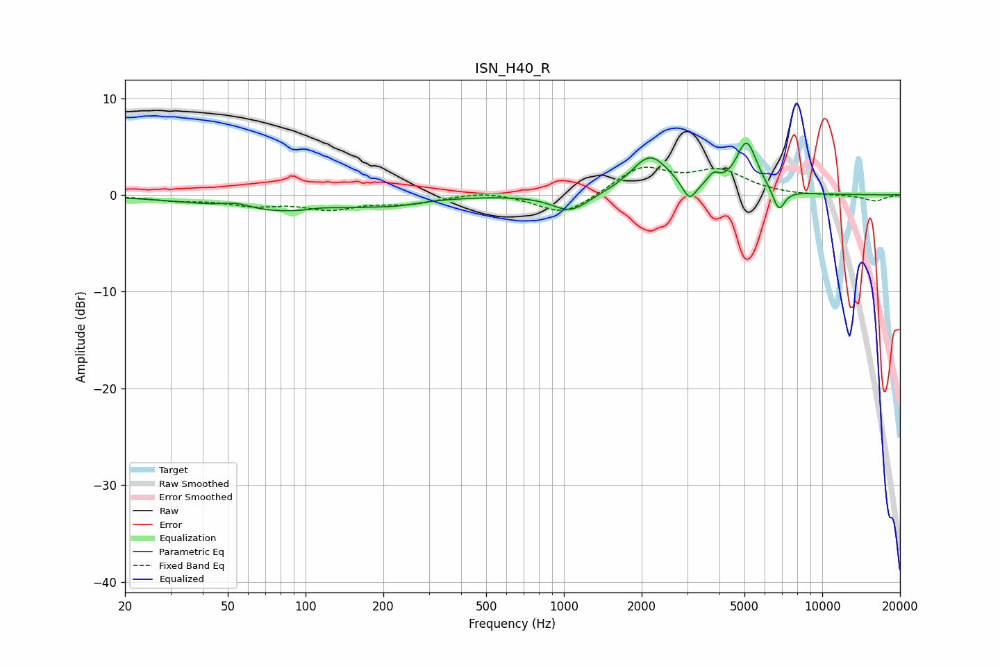

# ISN_H40_R
See [usage instructions](https://github.com/jaakkopasanen/AutoEq#usage) for more options and info.

### Parametric EQs
Apply preamp of -5.4 dB when using parametric equalizer.

|   # | Type    |   Fc (Hz) |    Q |   Gain (dB) |
|-----|---------|-----------|------|-------------|
|   1 | Peaking |        54 | 2.51 |         0.6 |
|   2 | Peaking |        82 | 0.53 |        -1.7 |
|   3 | Peaking |       116 | 2.71 |         0.2 |
|   4 | Peaking |       222 | 1.39 |        -0.5 |
|   5 | Peaking |      1061 | 2.01 |        -1.9 |
|   6 | Peaking |      2157 | 1.91 |         4   |
|   7 | Peaking |      3060 | 5.42 |        -1.9 |
|   8 | Peaking |      3793 | 6    |         1.1 |
|   9 | Peaking |      5098 | 3.41 |         5.2 |
|  10 | Peaking |      6792 | 5.86 |        -2.3 |

### Fixed Band EQs
When using fixed band (also called graphic) equalizer, apply preamp of **-3.0 dB** (if available) and set gains manually with these parameters.

|   # | Type    |   Fc (Hz) |    Q |   Gain (dB) |
|-----|---------|-----------|------|-------------|
|   1 | Peaking |        31 | 1.41 |        -0.5 |
|   2 | Peaking |        62 | 1.41 |        -0.9 |
|   3 | Peaking |       125 | 1.41 |        -1.3 |
|   4 | Peaking |       250 | 1.41 |        -0.8 |
|   5 | Peaking |       500 | 1.41 |         0.5 |
|   6 | Peaking |      1000 | 1.41 |        -2.2 |
|   7 | Peaking |      2000 | 1.41 |         2.8 |
|   8 | Peaking |      4000 | 1.41 |         2.3 |
|   9 | Peaking |      8000 | 1.41 |        -0.1 |
|  10 | Peaking |     16000 | 1.41 |        -0.6 |

### Graphs

