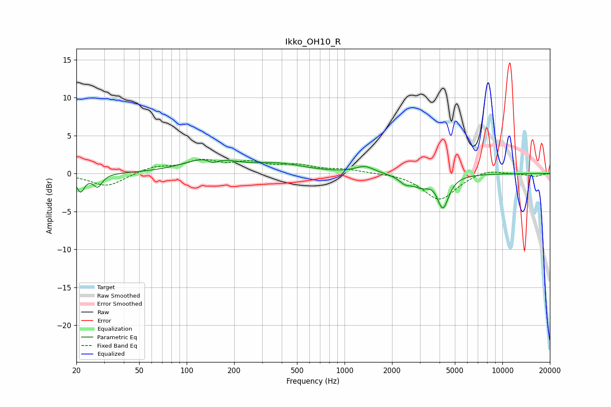

# Ikko_OH10_R
See [usage instructions](https://github.com/jaakkopasanen/AutoEq#usage) for more options and info.

### Parametric EQs
Apply preamp of -1.9 dB when using parametric equalizer.

|   # | Type    |   Fc (Hz) |    Q |   Gain (dB) |
|-----|---------|-----------|------|-------------|
|   1 | Peaking |        21 | 5.53 |        -2.3 |
|   2 | Peaking |        27 | 5.03 |        -1.6 |
|   3 | Peaking |       138 | 0.94 |         1.9 |
|   4 | Peaking |       147 | 4.53 |        -0.7 |
|   5 | Peaking |       386 | 0.86 |         1.1 |
|   6 | Peaking |      1345 | 2.41 |         0.9 |
|   7 | Peaking |      2415 | 3.82 |        -0.8 |
|   8 | Peaking |      3110 | 2.12 |        -1.6 |
|   9 | Peaking |      3689 | 2.73 |         0.6 |
|  10 | Peaking |      4194 | 3.78 |        -4.4 |

### Fixed Band EQs
When using fixed band (also called graphic) equalizer, apply preamp of **-2.0 dB** (if available) and set gains manually with these parameters.

|   # | Type    |   Fc (Hz) |    Q |   Gain (dB) |
|-----|---------|-----------|------|-------------|
|   1 | Peaking |        31 | 1.41 |        -1.7 |
|   2 | Peaking |        62 | 1.41 |         0.8 |
|   3 | Peaking |       125 | 1.41 |         1.5 |
|   4 | Peaking |       250 | 1.41 |         1.2 |
|   5 | Peaking |       500 | 1.41 |         0.9 |
|   6 | Peaking |      1000 | 1.41 |         0.5 |
|   7 | Peaking |      2000 | 1.41 |         0.1 |
|   8 | Peaking |      4000 | 1.41 |        -3.5 |
|   9 | Peaking |      8000 | 1.41 |         0.6 |
|  10 | Peaking |     16000 | 1.41 |        -0.4 |

### Graphs

