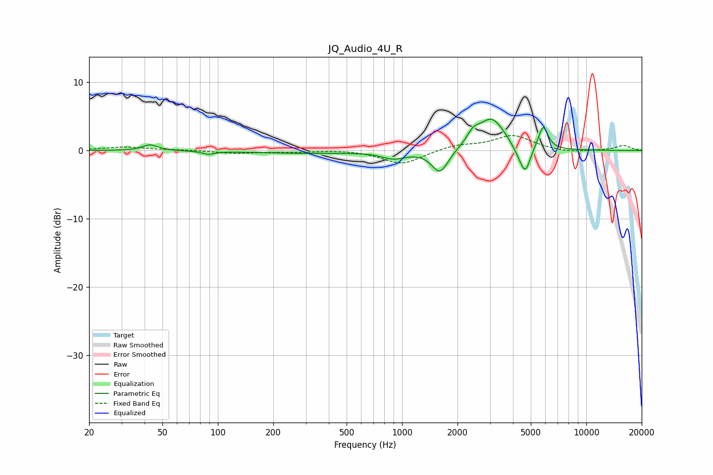

# JQ_Audio_4U_R
See [usage instructions](https://github.com/jaakkopasanen/AutoEq#usage) for more options and info.

### Parametric EQs
Apply preamp of -4.7 dB when using parametric equalizer.

|   # | Type    |   Fc (Hz) |    Q |   Gain (dB) |
|-----|---------|-----------|------|-------------|
|   1 | Peaking |        43 | 3.44 |         0.9 |
|   2 | Peaking |        89 | 4.48 |        -0.4 |
|   3 | Peaking |       298 | 0.47 |        -0.4 |
|   4 | Peaking |       902 | 2.18 |        -1   |
|   5 | Peaking |      1608 | 3.14 |        -3.4 |
|   6 | Peaking |      2438 | 4.16 |         1.5 |
|   7 | Peaking |      3070 | 1.96 |         4.7 |
|   8 | Peaking |      4263 | 4.05 |        -1   |
|   9 | Peaking |      4666 | 5.21 |        -3.7 |
|  10 | Peaking |      5837 | 5.41 |         3.5 |

### Fixed Band EQs
When using fixed band (also called graphic) equalizer, apply preamp of **-2.3 dB** (if available) and set gains manually with these parameters.

|   # | Type    |   Fc (Hz) |    Q |   Gain (dB) |
|-----|---------|-----------|------|-------------|
|   1 | Peaking |        31 | 1.41 |         0.5 |
|   2 | Peaking |        62 | 1.41 |         0.1 |
|   3 | Peaking |       125 | 1.41 |        -0.4 |
|   4 | Peaking |       250 | 1.41 |        -0.2 |
|   5 | Peaking |       500 | 1.41 |         0.1 |
|   6 | Peaking |      1000 | 1.41 |        -2   |
|   7 | Peaking |      2000 | 1.41 |         0.8 |
|   8 | Peaking |      4000 | 1.41 |         2.2 |
|   9 | Peaking |      8000 | 1.41 |        -0.3 |
|  10 | Peaking |     16000 | 1.41 |         0.7 |

### Graphs

