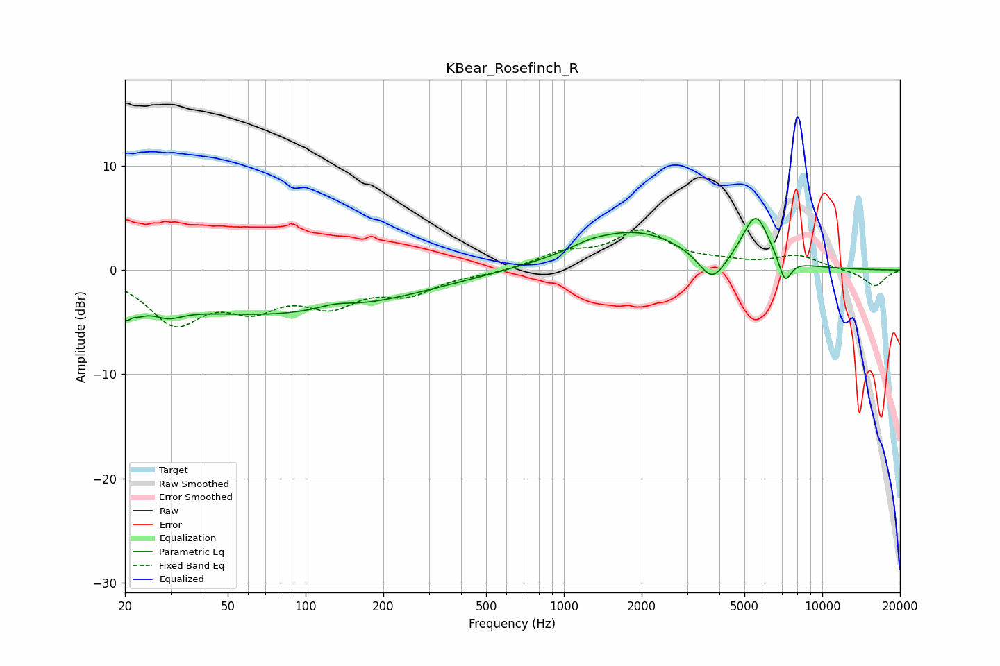

# KBear_Rosefinch_R
See [usage instructions](https://github.com/jaakkopasanen/AutoEq#usage) for more options and info.

### Parametric EQs
Apply preamp of -5.1 dB when using parametric equalizer.

|   # | Type    |   Fc (Hz) |    Q |   Gain (dB) |
|-----|---------|-----------|------|-------------|
|   1 | Peaking |        21 | 4.38 |        -4.5 |
|   2 | Peaking |        21 | 5.99 |         2.6 |
|   3 | Peaking |        29 | 2.42 |        -1.1 |
|   4 | Peaking |        72 | 0.25 |        -4.2 |
|   5 | Peaking |       130 | 1.95 |         0.6 |
|   6 | Peaking |      1260 | 2.25 |         0.3 |
|   7 | Peaking |      1864 | 0.66 |         3.7 |
|   8 | Peaking |      3749 | 2.61 |        -2.9 |
|   9 | Peaking |      5533 | 2.67 |         4.8 |
|  10 | Peaking |      7174 | 5.56 |        -2.4 |

### Fixed Band EQs
When using fixed band (also called graphic) equalizer, apply preamp of **-4.0 dB** (if available) and set gains manually with these parameters.

|   # | Type    |   Fc (Hz) |    Q |   Gain (dB) |
|-----|---------|-----------|------|-------------|
|   1 | Peaking |        31 | 1.41 |        -4.8 |
|   2 | Peaking |        62 | 1.41 |        -3   |
|   3 | Peaking |       125 | 1.41 |        -2.9 |
|   4 | Peaking |       250 | 1.41 |        -2   |
|   5 | Peaking |       500 | 1.41 |        -0.3 |
|   6 | Peaking |      1000 | 1.41 |         1.4 |
|   7 | Peaking |      2000 | 1.41 |         3.5 |
|   8 | Peaking |      4000 | 1.41 |         0.5 |
|   9 | Peaking |      8000 | 1.41 |         1.3 |
|  10 | Peaking |     16000 | 1.41 |        -1.6 |

### Graphs

