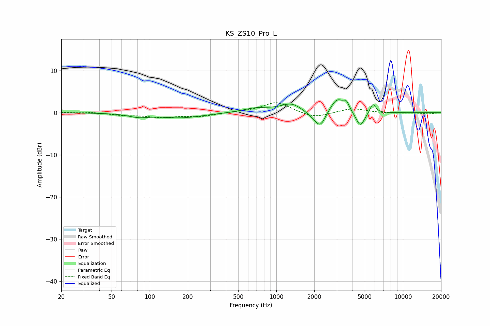

# KS_ZS10_Pro_L
See [usage instructions](https://github.com/jaakkopasanen/AutoEq#usage) for more options and info.

### Parametric EQs
Apply preamp of -3.2 dB when using parametric equalizer.

|   # | Type    |   Fc (Hz) |    Q |   Gain (dB) |
|-----|---------|-----------|------|-------------|
|   1 | Peaking |        81 | 1.83 |        -0.8 |
|   2 | Peaking |       176 | 0.81 |        -1.2 |
|   3 | Peaking |       698 | 1.32 |         1   |
|   4 | Peaking |      1315 | 1.71 |         2.1 |
|   5 | Peaking |      1949 | 2.3  |        -0.8 |
|   6 | Peaking |      2225 | 3.4  |        -3.5 |
|   7 | Peaking |      3015 | 2.71 |         3.4 |
|   8 | Peaking |      3571 | 5.98 |         1.8 |
|   9 | Peaking |      4608 | 4.06 |        -3.6 |
|  10 | Peaking |      5786 | 5.94 |         2.4 |

### Fixed Band EQs
When using fixed band (also called graphic) equalizer, apply preamp of **-2.5 dB** (if available) and set gains manually with these parameters.

|   # | Type    |   Fc (Hz) |    Q |   Gain (dB) |
|-----|---------|-----------|------|-------------|
|   1 | Peaking |        31 | 1.41 |         0.2 |
|   2 | Peaking |        62 | 1.41 |        -0.6 |
|   3 | Peaking |       125 | 1.41 |        -1   |
|   4 | Peaking |       250 | 1.41 |        -0.8 |
|   5 | Peaking |       500 | 1.41 |         0.1 |
|   6 | Peaking |      1000 | 1.41 |         2.6 |
|   7 | Peaking |      2000 | 1.41 |        -1.3 |
|   8 | Peaking |      4000 | 1.41 |         1.1 |
|   9 | Peaking |      8000 | 1.41 |        -0.2 |
|  10 | Peaking |     16000 | 1.41 |        -0.3 |

### Graphs

