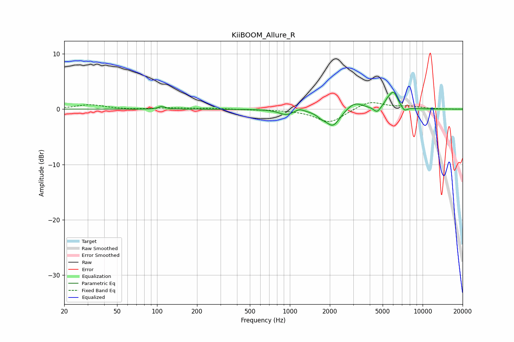

# KiiBOOM_Allure_R
See [usage instructions](https://github.com/jaakkopasanen/AutoEq#usage) for more options and info.

### Parametric EQs
Apply preamp of -3.2 dB when using parametric equalizer.

|   # | Type    |   Fc (Hz) |    Q |   Gain (dB) |
|-----|---------|-----------|------|-------------|
|   1 | Peaking |       108 | 5.99 |         0.5 |
|   2 | Peaking |       938 | 2.72 |        -0.9 |
|   3 | Peaking |      1182 | 4.43 |         0.5 |
|   4 | Peaking |      1722 | 4.15 |        -0.6 |
|   5 | Peaking |      2113 | 2.63 |        -3.1 |
|   6 | Peaking |      3075 | 2.25 |         1.4 |
|   7 | Peaking |      4536 | 5.84 |        -1   |
|   8 | Peaking |      5419 | 6    |         0.7 |
|   9 | Peaking |      6028 | 4.09 |         3   |
|  10 | Peaking |      7285 | 5.99 |        -0.8 |

### Fixed Band EQs
When using fixed band (also called graphic) equalizer, apply preamp of **-1.3 dB** (if available) and set gains manually with these parameters.

|   # | Type    |   Fc (Hz) |    Q |   Gain (dB) |
|-----|---------|-----------|------|-------------|
|   1 | Peaking |        31 | 1.41 |         0.8 |
|   2 | Peaking |        62 | 1.41 |        -0.1 |
|   3 | Peaking |       125 | 1.41 |         0.2 |
|   4 | Peaking |       250 | 1.41 |         0.2 |
|   5 | Peaking |       500 | 1.41 |        -0.1 |
|   6 | Peaking |      1000 | 1.41 |        -0.1 |
|   7 | Peaking |      2000 | 1.41 |        -2.5 |
|   8 | Peaking |      4000 | 1.41 |         1.5 |
|   9 | Peaking |      8000 | 1.41 |         0.4 |
|  10 | Peaking |     16000 | 1.41 |         0   |

### Graphs

