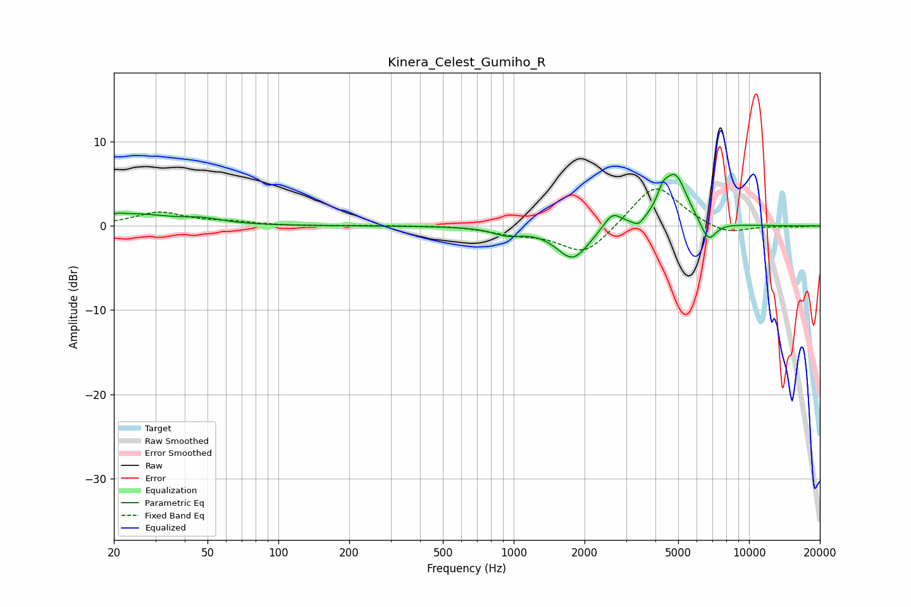

# Kinera_Celest_Gumiho_R
See [usage instructions](https://github.com/jaakkopasanen/AutoEq#usage) for more options and info.

### Parametric EQs
Apply preamp of -6.2 dB when using parametric equalizer.

|   # | Type    |   Fc (Hz) |    Q |   Gain (dB) |
|-----|---------|-----------|------|-------------|
|   1 | Peaking |        20 | 5.98 |         0.2 |
|   2 | Peaking |        23 | 0.87 |         1.4 |
|   3 | Peaking |        48 | 1.73 |         0.5 |
|   4 | Peaking |       938 | 2.34 |        -0.8 |
|   5 | Peaking |      1781 | 2.05 |        -3.9 |
|   6 | Peaking |      2624 | 3.68 |         1.9 |
|   7 | Peaking |      3390 | 5.97 |        -0.9 |
|   8 | Peaking |      4297 | 5.97 |         1.6 |
|   9 | Peaking |      4858 | 2.69 |         6   |
|  10 | Peaking |      6711 | 4.05 |        -2.6 |

### Fixed Band EQs
When using fixed band (also called graphic) equalizer, apply preamp of **-4.5 dB** (if available) and set gains manually with these parameters.

|   # | Type    |   Fc (Hz) |    Q |   Gain (dB) |
|-----|---------|-----------|------|-------------|
|   1 | Peaking |        31 | 1.41 |         1.6 |
|   2 | Peaking |        62 | 1.41 |         0.4 |
|   3 | Peaking |       125 | 1.41 |        -0   |
|   4 | Peaking |       250 | 1.41 |         0.1 |
|   5 | Peaking |       500 | 1.41 |         0.1 |
|   6 | Peaking |      1000 | 1.41 |        -0.8 |
|   7 | Peaking |      2000 | 1.41 |        -3.5 |
|   8 | Peaking |      4000 | 1.41 |         5.2 |
|   9 | Peaking |      8000 | 1.41 |        -1.1 |
|  10 | Peaking |     16000 | 1.41 |        -0.1 |

### Graphs

