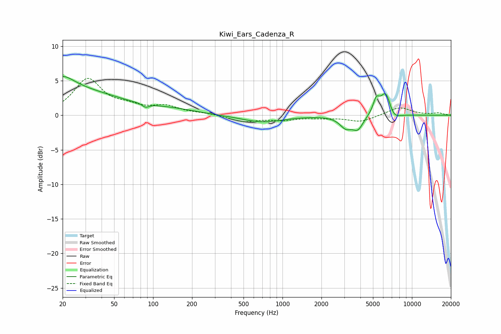

# Kiwi_Ears_Cadenza_R
See [usage instructions](https://github.com/jaakkopasanen/AutoEq#usage) for more options and info.

### Parametric EQs
Apply preamp of -5.7 dB when using parametric equalizer.

|   # | Type    |   Fc (Hz) |    Q |   Gain (dB) |
|-----|---------|-----------|------|-------------|
|   1 | Peaking |        20 | 1.64 |         1.8 |
|   2 | Peaking |        20 | 0.34 |         3.8 |
|   3 | Peaking |        87 | 5.59 |        -0.5 |
|   4 | Peaking |       141 | 0.73 |         0.6 |
|   5 | Peaking |       696 | 0.88 |        -1   |
|   6 | Peaking |      3083 | 2.99 |        -1.6 |
|   7 | Peaking |      3822 | 3.37 |        -1.8 |
|   8 | Peaking |      5300 | 5.58 |         1.9 |
|   9 | Peaking |      6301 | 3.16 |         3.9 |
|  10 | Peaking |      7091 | 2.73 |        -1.5 |

### Fixed Band EQs
When using fixed band (also called graphic) equalizer, apply preamp of **-5.4 dB** (if available) and set gains manually with these parameters.

|   # | Type    |   Fc (Hz) |    Q |   Gain (dB) |
|-----|---------|-----------|------|-------------|
|   1 | Peaking |        31 | 1.41 |         5.1 |
|   2 | Peaking |        62 | 1.41 |         1   |
|   3 | Peaking |       125 | 1.41 |         1.2 |
|   4 | Peaking |       250 | 1.41 |         0.2 |
|   5 | Peaking |       500 | 1.41 |        -0.9 |
|   6 | Peaking |      1000 | 1.41 |        -0.6 |
|   7 | Peaking |      2000 | 1.41 |        -0.3 |
|   8 | Peaking |      4000 | 1.41 |        -0.9 |
|   9 | Peaking |      8000 | 1.41 |         1.2 |
|  10 | Peaking |     16000 | 1.41 |         0.3 |

### Graphs

