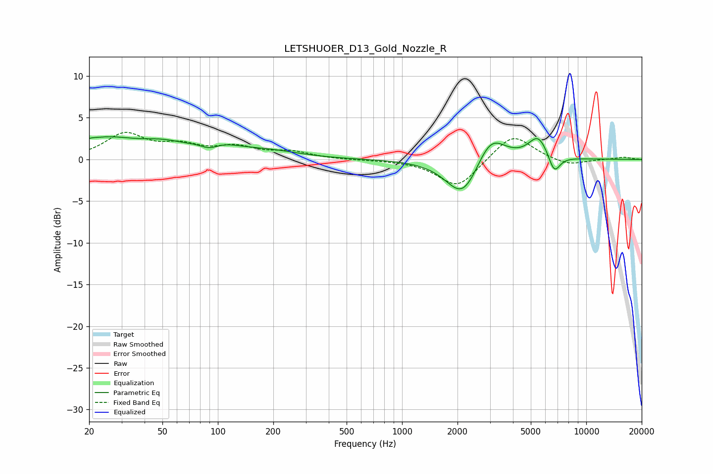

# LETSHUOER_D13_Gold_Nozzle_R
See [usage instructions](https://github.com/jaakkopasanen/AutoEq#usage) for more options and info.

### Parametric EQs
Apply preamp of -2.8 dB when using parametric equalizer.

|   # | Type    |   Fc (Hz) |    Q |   Gain (dB) |
|-----|---------|-----------|------|-------------|
|   1 | Peaking |        20 | 5.14 |         0.2 |
|   2 | Peaking |        24 | 0.78 |         2.4 |
|   3 | Peaking |        50 | 1.27 |         1   |
|   4 | Peaking |        90 | 2.51 |        -1.2 |
|   5 | Peaking |        95 | 1.17 |         1.8 |
|   6 | Peaking |       193 | 0.85 |         0.8 |
|   7 | Peaking |      2141 | 1.56 |        -4.9 |
|   8 | Peaking |      3021 | 1.76 |         3.7 |
|   9 | Peaking |      5489 | 2.6  |         2.7 |
|  10 | Peaking |      6703 | 4.24 |        -2.3 |

### Fixed Band EQs
When using fixed band (also called graphic) equalizer, apply preamp of **-3.3 dB** (if available) and set gains manually with these parameters.

|   # | Type    |   Fc (Hz) |    Q |   Gain (dB) |
|-----|---------|-----------|------|-------------|
|   1 | Peaking |        31 | 1.41 |         2.9 |
|   2 | Peaking |        62 | 1.41 |         1.4 |
|   3 | Peaking |       125 | 1.41 |         1.3 |
|   4 | Peaking |       250 | 1.41 |         0.8 |
|   5 | Peaking |       500 | 1.41 |        -0.1 |
|   6 | Peaking |      1000 | 1.41 |        -0.1 |
|   7 | Peaking |      2000 | 1.41 |        -3.4 |
|   8 | Peaking |      4000 | 1.41 |         3.2 |
|   9 | Peaking |      8000 | 1.41 |        -0.8 |
|  10 | Peaking |     16000 | 1.41 |         0.3 |

### Graphs

