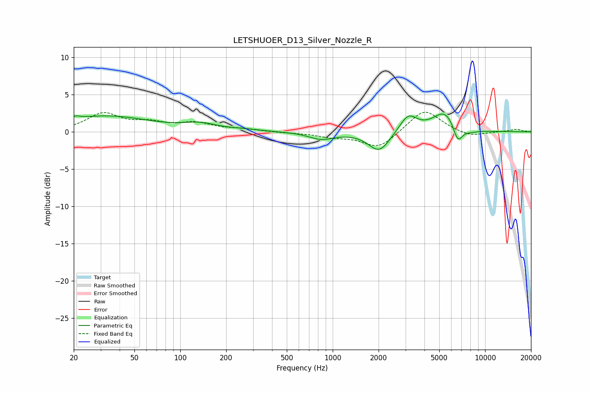

# LETSHUOER_D13_Silver_Nozzle_R
See [usage instructions](https://github.com/jaakkopasanen/AutoEq#usage) for more options and info.

### Parametric EQs
Apply preamp of -2.5 dB when using parametric equalizer.

|   # | Type    |   Fc (Hz) |    Q |   Gain (dB) |
|-----|---------|-----------|------|-------------|
|   1 | Peaking |        21 | 4.82 |         0.4 |
|   2 | Peaking |        33 | 0.49 |         2.1 |
|   3 | Peaking |       136 | 1.32 |         0.8 |
|   4 | Peaking |       264 | 1.4  |         0.2 |
|   5 | Peaking |       841 | 1.75 |        -0.9 |
|   6 | Peaking |      2021 | 2.01 |        -2.7 |
|   7 | Peaking |      3126 | 2.5  |         2.3 |
|   8 | Peaking |      5475 | 1.74 |         2.8 |
|   9 | Peaking |      6617 | 4.28 |        -2.5 |
|  10 | Peaking |      7919 | 2.17 |        -0.4 |

### Fixed Band EQs
When using fixed band (also called graphic) equalizer, apply preamp of **-2.7 dB** (if available) and set gains manually with these parameters.

|   # | Type    |   Fc (Hz) |    Q |   Gain (dB) |
|-----|---------|-----------|------|-------------|
|   1 | Peaking |        31 | 1.41 |         2.4 |
|   2 | Peaking |        62 | 1.41 |         1   |
|   3 | Peaking |       125 | 1.41 |         1.1 |
|   4 | Peaking |       250 | 1.41 |         0.3 |
|   5 | Peaking |       500 | 1.41 |        -0.1 |
|   6 | Peaking |      1000 | 1.41 |        -0.6 |
|   7 | Peaking |      2000 | 1.41 |        -2.2 |
|   8 | Peaking |      4000 | 1.41 |         3.1 |
|   9 | Peaking |      8000 | 1.41 |        -0.7 |
|  10 | Peaking |     16000 | 1.41 |         0.3 |

### Graphs

