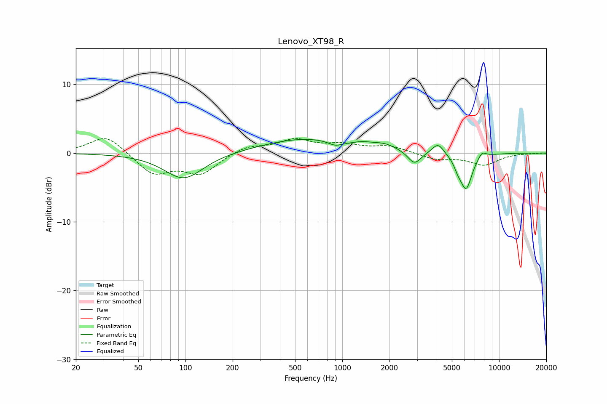

# Lenovo_XT98_R
See [usage instructions](https://github.com/jaakkopasanen/AutoEq#usage) for more options and info.

### Parametric EQs
Apply preamp of -2.1 dB when using parametric equalizer.

|   # | Type    |   Fc (Hz) |    Q |   Gain (dB) |
|-----|---------|-----------|------|-------------|
|   1 | Peaking |        97 | 1.14 |        -3.8 |
|   2 | Peaking |       583 | 0.51 |         2.1 |
|   3 | Peaking |       904 | 3.14 |        -0.7 |
|   4 | Peaking |      1350 | 2.55 |         0.4 |
|   5 | Peaking |      1856 | 1.79 |         0.8 |
|   6 | Peaking |      2882 | 3.37 |        -1.9 |
|   7 | Peaking |      4076 | 3.76 |         1.6 |
|   8 | Peaking |      5451 | 5.8  |        -1   |
|   9 | Peaking |      6158 | 3.58 |        -5.1 |
|  10 | Peaking |      7782 | 5.16 |         0.9 |

### Fixed Band EQs
When using fixed band (also called graphic) equalizer, apply preamp of **-2.2 dB** (if available) and set gains manually with these parameters.

|   # | Type    |   Fc (Hz) |    Q |   Gain (dB) |
|-----|---------|-----------|------|-------------|
|   1 | Peaking |        31 | 1.41 |         2.7 |
|   2 | Peaking |        62 | 1.41 |        -3   |
|   3 | Peaking |       125 | 1.41 |        -2.9 |
|   4 | Peaking |       250 | 1.41 |         1.1 |
|   5 | Peaking |       500 | 1.41 |         1.8 |
|   6 | Peaking |      1000 | 1.41 |         1.1 |
|   7 | Peaking |      2000 | 1.41 |         1   |
|   8 | Peaking |      4000 | 1.41 |        -0.9 |
|   9 | Peaking |      8000 | 1.41 |        -1.7 |
|  10 | Peaking |     16000 | 1.41 |        -0   |

### Graphs

