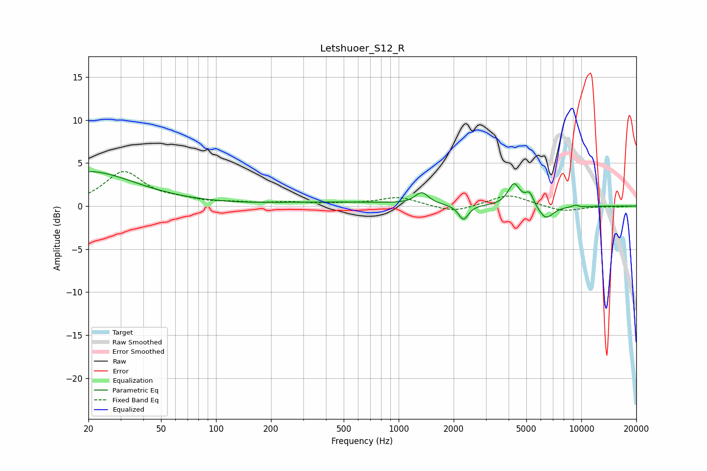

# Letshuoer_S12_R
See [usage instructions](https://github.com/jaakkopasanen/AutoEq#usage) for more options and info.

### Parametric EQs
Apply preamp of -4.1 dB when using parametric equalizer.

|   # | Type    |   Fc (Hz) |    Q |   Gain (dB) |
|-----|---------|-----------|------|-------------|
|   1 | Peaking |        20 | 0.62 |         2.9 |
|   2 | Peaking |        20 | 0.35 |         1.1 |
|   3 | Peaking |       472 | 0.41 |         0.4 |
|   4 | Peaking |      1339 | 3.91 |         1.4 |
|   5 | Peaking |      2262 | 5.3  |        -1.7 |
|   6 | Peaking |      4281 | 4.32 |         2.6 |
|   7 | Peaking |      5205 | 6    |         1.5 |
|   8 | Peaking |      6392 | 3.27 |        -1.6 |
|   9 | Peaking |      9352 | 5.98 |         0.3 |
|  10 | Peaking |      9722 | 3.91 |        -0.2 |

### Fixed Band EQs
When using fixed band (also called graphic) equalizer, apply preamp of **-4.1 dB** (if available) and set gains manually with these parameters.

|   # | Type    |   Fc (Hz) |    Q |   Gain (dB) |
|-----|---------|-----------|------|-------------|
|   1 | Peaking |        31 | 1.41 |         3.9 |
|   2 | Peaking |        62 | 1.41 |         0.5 |
|   3 | Peaking |       125 | 1.41 |         0.3 |
|   4 | Peaking |       250 | 1.41 |         0.4 |
|   5 | Peaking |       500 | 1.41 |         0.2 |
|   6 | Peaking |      1000 | 1.41 |         1   |
|   7 | Peaking |      2000 | 1.41 |        -0.8 |
|   8 | Peaking |      4000 | 1.41 |         1.4 |
|   9 | Peaking |      8000 | 1.41 |        -0.7 |
|  10 | Peaking |     16000 | 1.41 |        -0.1 |

### Graphs

