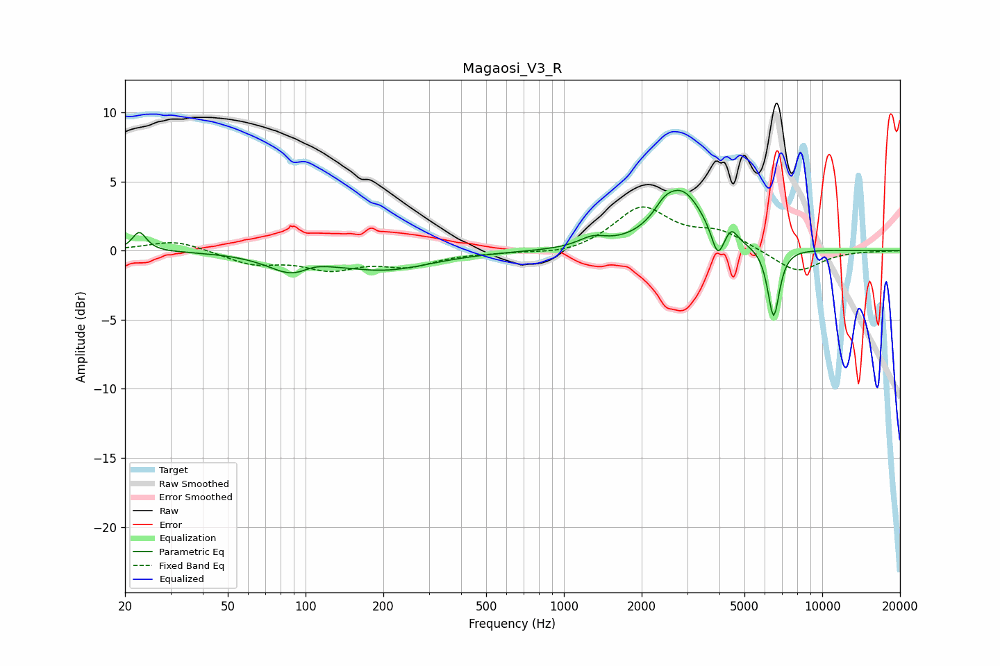

# Magaosi_V3_R
See [usage instructions](https://github.com/jaakkopasanen/AutoEq#usage) for more options and info.

### Parametric EQs
Apply preamp of -4.5 dB when using parametric equalizer.

|   # | Type    |   Fc (Hz) |    Q |   Gain (dB) |
|-----|---------|-----------|------|-------------|
|   1 | Peaking |        23 | 5.31 |         1.4 |
|   2 | Peaking |        93 | 1.48 |        -1.9 |
|   3 | Peaking |       105 | 2.05 |         0.9 |
|   4 | Peaking |       207 | 0.79 |        -1.3 |
|   5 | Peaking |      1288 | 2.68 |         0.7 |
|   6 | Peaking |      2441 | 3.82 |         0.7 |
|   7 | Peaking |      2862 | 1.62 |         4.2 |
|   8 | Peaking |      3940 | 5.91 |        -2.1 |
|   9 | Peaking |      4454 | 6    |         0.9 |
|  10 | Peaking |      6482 | 6    |        -5.1 |

### Fixed Band EQs
When using fixed band (also called graphic) equalizer, apply preamp of **-3.3 dB** (if available) and set gains manually with these parameters.

|   # | Type    |   Fc (Hz) |    Q |   Gain (dB) |
|-----|---------|-----------|------|-------------|
|   1 | Peaking |        31 | 1.41 |         0.8 |
|   2 | Peaking |        62 | 1.41 |        -0.9 |
|   3 | Peaking |       125 | 1.41 |        -1.2 |
|   4 | Peaking |       250 | 1.41 |        -1   |
|   5 | Peaking |       500 | 1.41 |        -0.1 |
|   6 | Peaking |      1000 | 1.41 |        -0.4 |
|   7 | Peaking |      2000 | 1.41 |         3.1 |
|   8 | Peaking |      4000 | 1.41 |         1.2 |
|   9 | Peaking |      8000 | 1.41 |        -1.6 |
|  10 | Peaking |     16000 | 1.41 |        -0   |

### Graphs

