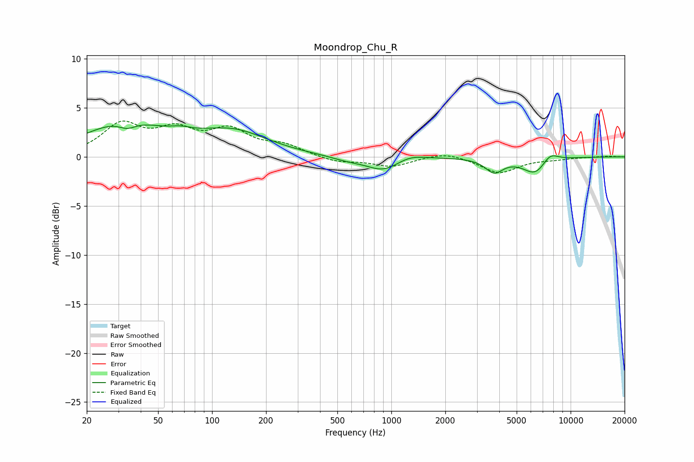

# Moondrop_Chu_R
See [usage instructions](https://github.com/jaakkopasanen/AutoEq#usage) for more options and info.

### Parametric EQs
Apply preamp of -3.3 dB when using parametric equalizer.

|   # | Type    |   Fc (Hz) |    Q |   Gain (dB) |
|-----|---------|-----------|------|-------------|
|   1 | Peaking |        32 | 0.65 |         3.4 |
|   2 | Peaking |        34 | 2.87 |        -0.8 |
|   3 | Peaking |        67 | 2.26 |         0.4 |
|   4 | Peaking |       131 | 0.73 |         2.4 |
|   5 | Peaking |       573 | 1.47 |        -0.4 |
|   6 | Peaking |       902 | 1.56 |        -1.4 |
|   7 | Peaking |      1272 | 1.86 |         0.5 |
|   8 | Peaking |      3745 | 2.84 |        -1.4 |
|   9 | Peaking |      6382 | 1.97 |        -1.8 |
|  10 | Peaking |      7637 | 2.83 |         1.1 |

### Fixed Band EQs
When using fixed band (also called graphic) equalizer, apply preamp of **-3.7 dB** (if available) and set gains manually with these parameters.

|   # | Type    |   Fc (Hz) |    Q |   Gain (dB) |
|-----|---------|-----------|------|-------------|
|   1 | Peaking |        31 | 1.41 |         3.1 |
|   2 | Peaking |        62 | 1.41 |         2.3 |
|   3 | Peaking |       125 | 1.41 |         2.4 |
|   4 | Peaking |       250 | 1.41 |         1   |
|   5 | Peaking |       500 | 1.41 |        -0.6 |
|   6 | Peaking |      1000 | 1.41 |        -1   |
|   7 | Peaking |      2000 | 1.41 |         0.6 |
|   8 | Peaking |      4000 | 1.41 |        -1.6 |
|   9 | Peaking |      8000 | 1.41 |        -0.2 |
|  10 | Peaking |     16000 | 1.41 |         0.1 |

### Graphs

