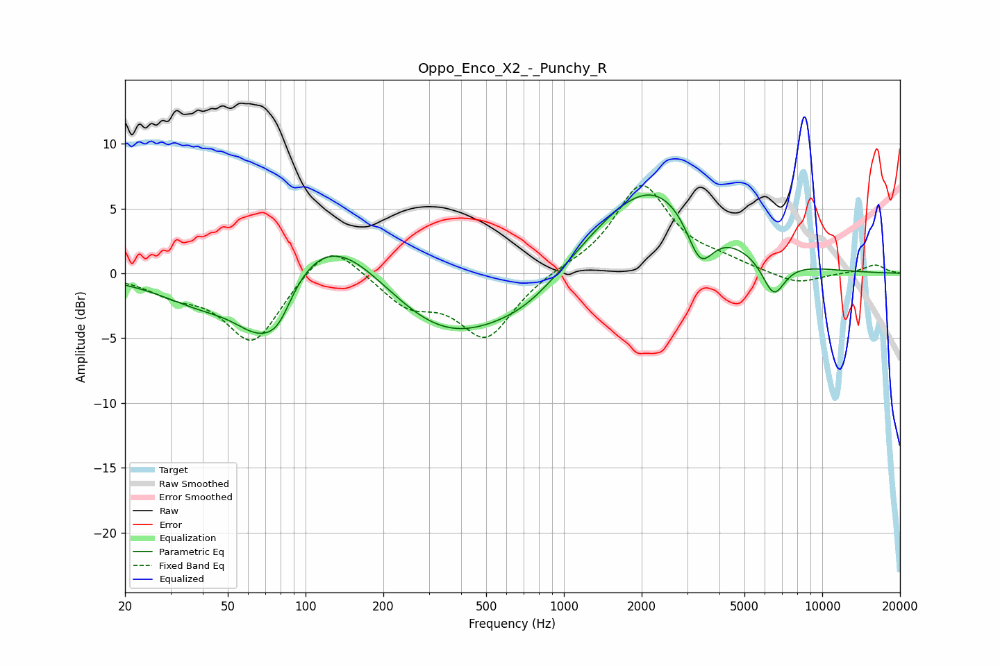

# Oppo_Enco_X2_-_Punchy_R
See [usage instructions](https://github.com/jaakkopasanen/AutoEq#usage) for more options and info.

### Parametric EQs
Apply preamp of -6.1 dB when using parametric equalizer.

|   # | Type    |   Fc (Hz) |    Q |   Gain (dB) |
|-----|---------|-----------|------|-------------|
|   1 | Peaking |        40 | 0.84 |        -2.2 |
|   2 | Peaking |        67 | 1.34 |        -4.6 |
|   3 | Peaking |        79 | 2.72 |        -1.8 |
|   4 | Peaking |       124 | 0.67 |         4.9 |
|   5 | Peaking |       348 | 0.55 |        -5.4 |
|   6 | Peaking |       729 | 0.95 |        -1.5 |
|   7 | Peaking |      1749 | 0.53 |         1.2 |
|   8 | Peaking |      2248 | 0.65 |         6.1 |
|   9 | Peaking |      3369 | 2.66 |        -3.8 |
|  10 | Peaking |      6484 | 3.01 |        -2.9 |

### Fixed Band EQs
When using fixed band (also called graphic) equalizer, apply preamp of **-6.9 dB** (if available) and set gains manually with these parameters.

|   # | Type    |   Fc (Hz) |    Q |   Gain (dB) |
|-----|---------|-----------|------|-------------|
|   1 | Peaking |        31 | 1.41 |        -1.2 |
|   2 | Peaking |        62 | 1.41 |        -5.3 |
|   3 | Peaking |       125 | 1.41 |         2.9 |
|   4 | Peaking |       250 | 1.41 |        -2.3 |
|   5 | Peaking |       500 | 1.41 |        -4.9 |
|   6 | Peaking |      1000 | 1.41 |         0.3 |
|   7 | Peaking |      2000 | 1.41 |         6.8 |
|   8 | Peaking |      4000 | 1.41 |         0.7 |
|   9 | Peaking |      8000 | 1.41 |        -0.9 |
|  10 | Peaking |     16000 | 1.41 |         0.7 |

### Graphs

