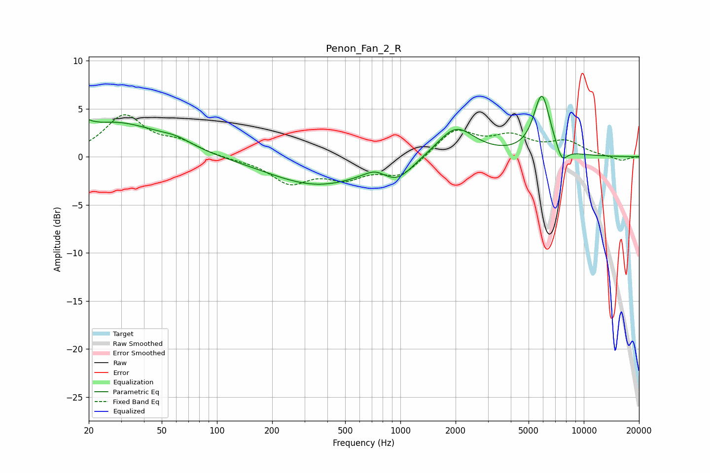

# Penon_Fan_2_R
See [usage instructions](https://github.com/jaakkopasanen/AutoEq#usage) for more options and info.

### Parametric EQs
Apply preamp of -6.4 dB when using parametric equalizer.

|   # | Type    |   Fc (Hz) |    Q |   Gain (dB) |
|-----|---------|-----------|------|-------------|
|   1 | Peaking |        20 | 5.51 |         3.3 |
|   2 | Peaking |        20 | 5.99 |        -2.5 |
|   3 | Peaking |        28 | 0.58 |         3.5 |
|   4 | Peaking |        60 | 1.62 |         0.7 |
|   5 | Peaking |       352 | 0.53 |        -2.9 |
|   6 | Peaking |       725 | 2.37 |         0.7 |
|   7 | Peaking |       964 | 1.73 |        -1.8 |
|   8 | Peaking |      2004 | 1.38 |         3.2 |
|   9 | Peaking |      5909 | 3.04 |         6.3 |
|  10 | Peaking |      7596 | 4.42 |        -1.6 |

### Fixed Band EQs
When using fixed band (also called graphic) equalizer, apply preamp of **-4.5 dB** (if available) and set gains manually with these parameters.

|   # | Type    |   Fc (Hz) |    Q |   Gain (dB) |
|-----|---------|-----------|------|-------------|
|   1 | Peaking |        31 | 1.41 |         4.2 |
|   2 | Peaking |        62 | 1.41 |         1.3 |
|   3 | Peaking |       125 | 1.41 |        -0.2 |
|   4 | Peaking |       250 | 1.41 |        -2.6 |
|   5 | Peaking |       500 | 1.41 |        -1.9 |
|   6 | Peaking |      1000 | 1.41 |        -2   |
|   7 | Peaking |      2000 | 1.41 |         2.8 |
|   8 | Peaking |      4000 | 1.41 |         1.9 |
|   9 | Peaking |      8000 | 1.41 |         1.4 |
|  10 | Peaking |     16000 | 1.41 |        -0.5 |

### Graphs

