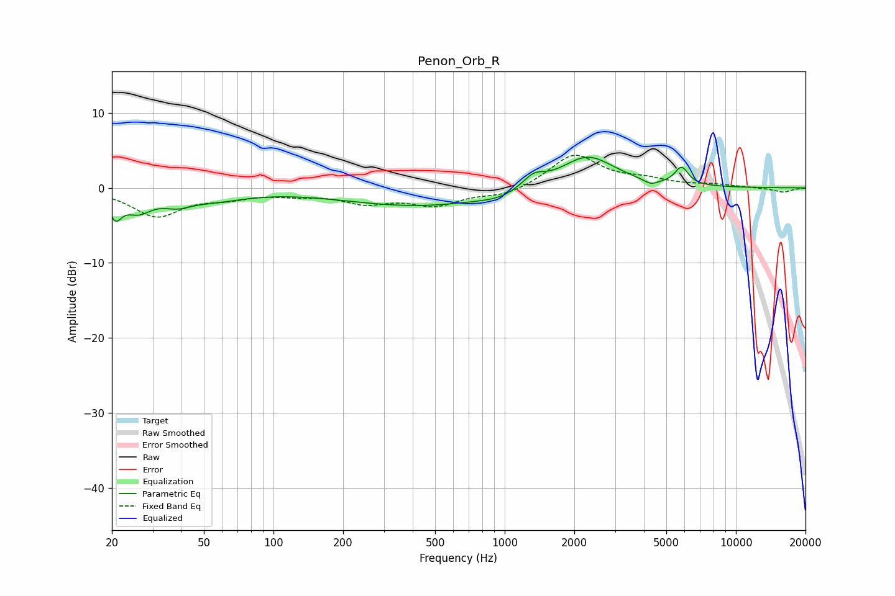

# Penon_Orb_R
See [usage instructions](https://github.com/jaakkopasanen/AutoEq#usage) for more options and info.

### Parametric EQs
Apply preamp of -4.2 dB when using parametric equalizer.

|   # | Type    |   Fc (Hz) |    Q |   Gain (dB) |
|-----|---------|-----------|------|-------------|
|   1 | Peaking |        21 | 5.23 |        -2.9 |
|   2 | Peaking |        26 | 2.38 |        -2.5 |
|   3 | Peaking |        38 | 2.26 |        -1.2 |
|   4 | Peaking |        54 | 0.98 |        -1.3 |
|   5 | Peaking |       433 | 0.42 |        -2.4 |
|   6 | Peaking |       947 | 1.7  |        -0.6 |
|   7 | Peaking |      1333 | 2.96 |         1.6 |
|   8 | Peaking |      2275 | 1.18 |         4.4 |
|   9 | Peaking |      4288 | 4.71 |        -0.7 |
|  10 | Peaking |      5822 | 4.72 |         2.3 |

### Fixed Band EQs
When using fixed band (also called graphic) equalizer, apply preamp of **-4.4 dB** (if available) and set gains manually with these parameters.

|   # | Type    |   Fc (Hz) |    Q |   Gain (dB) |
|-----|---------|-----------|------|-------------|
|   1 | Peaking |        31 | 1.41 |        -3.7 |
|   2 | Peaking |        62 | 1.41 |        -1   |
|   3 | Peaking |       125 | 1.41 |        -0.7 |
|   4 | Peaking |       250 | 1.41 |        -1.8 |
|   5 | Peaking |       500 | 1.41 |        -2.1 |
|   6 | Peaking |      1000 | 1.41 |        -1.1 |
|   7 | Peaking |      2000 | 1.41 |         4.5 |
|   8 | Peaking |      4000 | 1.41 |         0.9 |
|   9 | Peaking |      8000 | 1.41 |         0.4 |
|  10 | Peaking |     16000 | 1.41 |        -0.6 |

### Graphs

